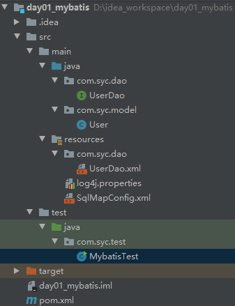
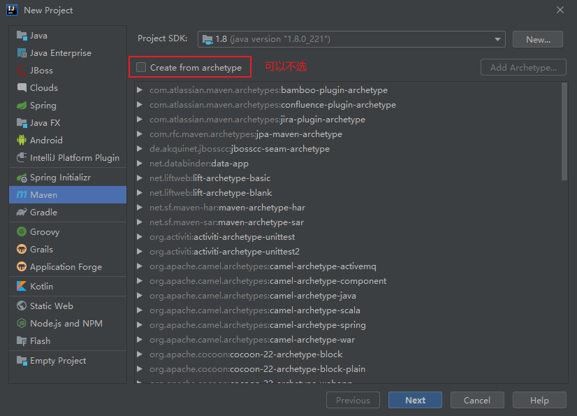
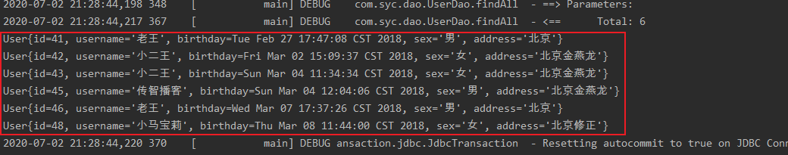
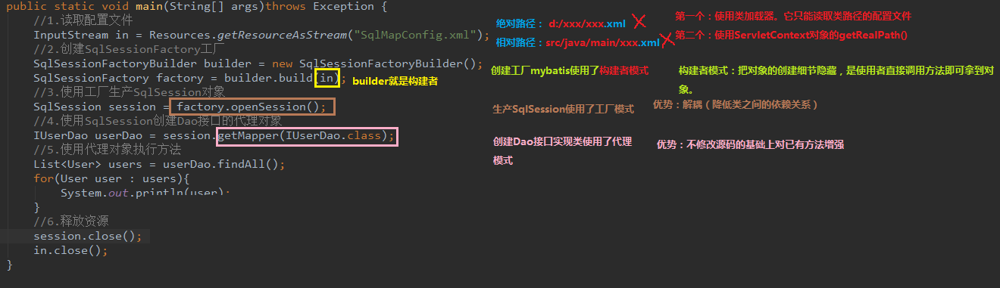
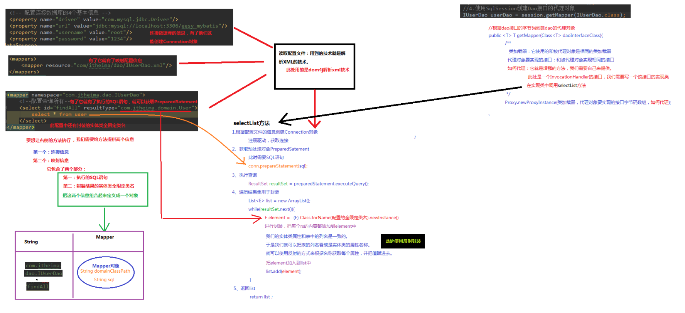
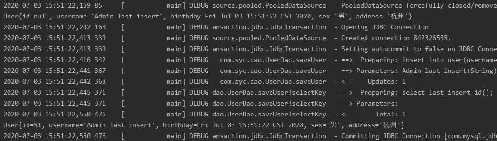
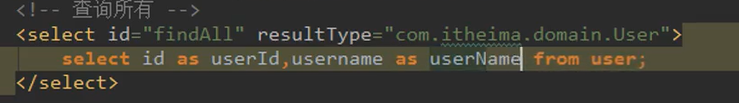
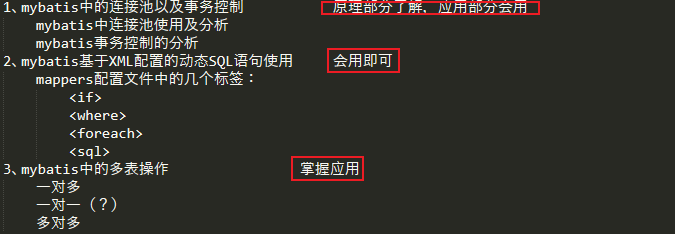
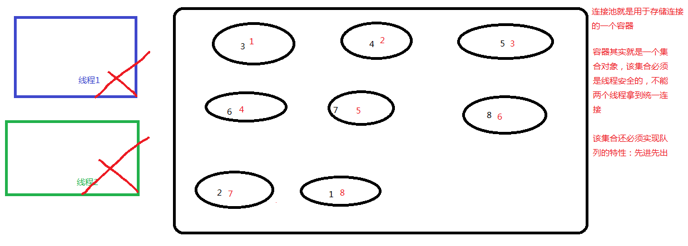

# Mybatis

## 一、Mybatis概述

mybatis是一个用Java编写的**持久层框架**。它封装了jdbc操作的很多细节，使开发者只需要关注sql语句本身，而无需关注注册驱动，创建连接等繁杂过程，它使用了ORM思想实现了结果集的封装。

**ORM**

Object Relational Mappging 对象关系映射
简单的说：就是把数据库表和实体类及实体类的属性对应起来让我们可以操作实体类就实现操作数据库表。

**MyBatis官网**

https://mybatis.org/mybatis-3/

## 二、环境搭建

第一步：创建maven工程并导入坐标
第二步：创建实体类和dao的接口
第三步：创建Mybatis的主配置文件
				SqlMapConifg.xml
第四步：创建映射配置文件
				IUserDao.xml

第五步：拷贝日志配置文件、编写测试类



### 1.创建maven工程、准备数据库



导入依赖

```xml
<?xml version="1.0" encoding="UTF-8"?>
<project xmlns="http://maven.apache.org/POM/4.0.0"
         xmlns:xsi="http://www.w3.org/2001/XMLSchema-instance"
         xsi:schemaLocation="http://maven.apache.org/POM/4.0.0 http://maven.apache.org/xsd/maven-4.0.0.xsd">
    <modelVersion>4.0.0</modelVersion>

    <groupId>com.syc</groupId>
    <artifactId>day01_mybatis</artifactId>
    <version>1.0-SNAPSHOT</version>
    <packaging>jar</packaging>

    <dependencies>
        <dependency>
            <groupId>org.mybatis</groupId>
            <artifactId>mybatis</artifactId>
            <version>3.4.5</version>
        </dependency>
        <dependency>
            <groupId>mysql</groupId>
            <artifactId>mysql-connector-java</artifactId>
            <version>5.1.6</version>
        </dependency>
        <dependency>
            <groupId>log4j</groupId>
            <artifactId>log4j</artifactId>
            <version>1.2.12</version>
        </dependency>
        <dependency>
            <groupId>junit</groupId>
            <artifactId>junit</artifactId>
            <version>4.11</version>
        </dependency>
    </dependencies>

</project>
```

**准备数据库**

创建一个数据库，如eesy_mybatis

```sql
DROP TABLE IF EXISTS `user`;

CREATE TABLE `user` (
  `id` int(11) NOT NULL auto_increment,
  `username` varchar(32) NOT NULL COMMENT '用户名称',
  `birthday` datetime default NULL COMMENT '生日',
  `sex` char(1) default NULL COMMENT '性别',
  `address` varchar(256) default NULL COMMENT '地址',
  PRIMARY KEY  (`id`)
) ENGINE=InnoDB DEFAULT CHARSET=utf8;

insert  into `user`(`id`,`username`,`birthday`,`sex`,`address`) values (41,'老王','2018-02-27 17:47:08','男','北京'),(42,'小二王','2018-03-02 15:09:37','女','北京金燕龙'),(43,'小二王','2018-03-04 11:34:34','女','北京金燕龙'),(45,'传智播客','2018-03-04 12:04:06','男','北京金燕龙'),(46,'老王','2018-03-07 17:37:26','男','北京'),(48,'小马宝莉','2018-03-08 11:44:00','女','北京修正');

DROP TABLE IF EXISTS `account`;

CREATE TABLE `account` (
  `ID` int(11) NOT NULL COMMENT '编号',
  `UID` int(11) default NULL COMMENT '用户编号',
  `MONEY` double default NULL COMMENT '金额',
  PRIMARY KEY  (`ID`),
  KEY `FK_Reference_8` (`UID`),
  CONSTRAINT `FK_Reference_8` FOREIGN KEY (`UID`) REFERENCES `user` (`id`)
) ENGINE=InnoDB DEFAULT CHARSET=utf8;

insert  into `account`(`ID`,`UID`,`MONEY`) values (1,41,1000),(2,45,1000),(3,41,2000);

DROP TABLE IF EXISTS `role`;

CREATE TABLE `role` (
  `ID` int(11) NOT NULL COMMENT '编号',
  `ROLE_NAME` varchar(30) default NULL COMMENT '角色名称',
  `ROLE_DESC` varchar(60) default NULL COMMENT '角色描述',
  PRIMARY KEY  (`ID`)
) ENGINE=InnoDB DEFAULT CHARSET=utf8;

insert  into `role`(`ID`,`ROLE_NAME`,`ROLE_DESC`) values (1,'院长','管理整个学院'),(2,'总裁','管理整个公司'),(3,'校长','管理整个学校');


DROP TABLE IF EXISTS `user_role`;

CREATE TABLE `user_role` (
  `UID` int(11) NOT NULL COMMENT '用户编号',
  `RID` int(11) NOT NULL COMMENT '角色编号',
  PRIMARY KEY  (`UID`,`RID`),
  KEY `FK_Reference_10` (`RID`),
  CONSTRAINT `FK_Reference_10` FOREIGN KEY (`RID`) REFERENCES `role` (`ID`),
  CONSTRAINT `FK_Reference_9` FOREIGN KEY (`UID`) REFERENCES `user` (`id`)
) ENGINE=InnoDB DEFAULT CHARSET=utf8;

insert  into `user_role`(`UID`,`RID`) values (41,1),(45,1),(41,2);

```

### 2.创建实体类和dao的接口

实体类

```java
package com.syc.model;

import java.io.Serializable;
import java.util.Date;

public class User implements Serializable {
    private Integer id;
    private String username;
    private Date birthday;
    private String sex;
    private String address;

    public Integer getId() {
        return id;
    }

    public void setId(Integer id) {
        this.id = id;
    }

    public String getUsername() {
        return username;
    }

    public void setUsername(String username) {
        this.username = username;
    }

    public Date getBirthday() {
        return birthday;
    }

    public void setBirthday(Date birthday) {
        this.birthday = birthday;
    }

    public String getSex() {
        return sex;
    }

    public void setSex(String sex) {
        this.sex = sex;
    }

    public String getAddress() {
        return address;
    }

    public void setAddress(String address) {
        this.address = address;
    }

    @Override
    public String toString() {
        return "User{" +
                "id=" + id +
                ", username='" + username + '\'' +
                ", birthday=" + birthday +
                ", sex='" + sex + '\'' +
                ", address='" + address + '\'' +
                '}';
    }
}

```

dao接口

```java
package com.syc.dao;

import com.syc.model.User;

import java.util.List;

public interface UserDao {

    List<User> findAll();
}

```

### 3.创建Mybatis的主配置文件

```xml
<?xml version="1.0" encoding="UTF-8"?>
<!DOCTYPE configuration
        PUBLIC "-//mybatis.org//DTD Config 3.0//EN"
        "http://mybatis.org/dtd/mybatis-3-config.dtd">
<!--mybatis的主配置文件-->
<configuration>
    <!-- 配置环境 -->
    <environments default="mysql">
        <!--配置mysql环境-->
        <environment id="mysql">
            <!--配置事务的类型-->
            <transactionManager type="JDBC"></transactionManager>
            <!--配置数据源（连接池）-->
            <dataSource type="POOLED">
                <property name="driver" value="com.mysql.jdbc.Driver"/>
                <property name="url" value="jdbc:mysql://localhost:3306/eesy_mybatis"/>
                <property name="Username" value="root"/>
                <property name="password" value="123456"/>
            </dataSource>
        </environment>
    </environments>

    <!-- 指定映射文件的位置，映射配置文件指的是每个dao独立的配置文件-->
    <mappers>
        <mapper resource="com/syc/dao/UserDao.xml"/>
    </mappers>
</configuration>
```

### 4.创建映射配置文件

```xml
<?xml version="1.0" encoding="UTF-8"?>
<!DOCTYPE mapper
        PUBLIC "-//mybatis.org//DTD Mapper 3.0//EN"
        "http://mybatis.org/dtd/mybatis-3-mapper.dtd">
 <mapper namespace="com.syc.dao.UserDao">
    <!--配置查询所有-->
    <select id="findAll" resultType="com.syc.model.User">
        select * from user
    </select>
</mapper>
```

环境搭建的注意事项

环境搭建的注意事项：
		第一个：创建IUserDao.xml 和 IUserDao.java时名称是为了和我们之前的知识保持一致。
			在Mybatis中它把持久层的操作接口名称和映射文件也叫做：Mapper
			所以：IUserDao 和 IUserMapper是一样的
		第二个：在idea中创建目录的时候，它和包是不一样的
			包在创建时：com.itheima.dao它是三级结构
			目录在创建时：com.itheima.dao是一级目录
		第三个：mybatis的映射配置文件位置必须和dao接口的包结构相同
		第四个：映射配置文件的mapper标签namespace属性的取值必须是dao接口的全限定类名
		第五个：映射配置文件的操作配置（select），id属性的取值必须是dao接口的方法名

​        当我们遵从了第三，四，五点之后，我们在开发中就无须再写dao的实现类。

### 5.拷贝日志配置文件、编写测试类

在resources下拷贝log4j.properties文件

```properties
# Set root category priority to INFO and its only appender to CONSOLE.
#log4j.rootCategory=INFO, CONSOLE            debug   info   warn error fatal
log4j.rootCategory=debug, CONSOLE, LOGFILE

# Set the enterprise logger category to FATAL and its only appender to CONSOLE.
log4j.logger.org.apache.axis.enterprise=FATAL, CONSOLE

# CONSOLE is set to be a ConsoleAppender using a PatternLayout.
log4j.appender.CONSOLE=org.apache.log4j.ConsoleAppender
log4j.appender.CONSOLE.layout=org.apache.log4j.PatternLayout
log4j.appender.CONSOLE.layout.ConversionPattern=%d{ISO8601} %-6r [%15.15t] %-5p %30.30c %x - %m\n

# LOGFILE is set to be a File appender using a PatternLayout.
log4j.appender.LOGFILE=org.apache.log4j.FileAppender
log4j.appender.LOGFILE.File=e:\axis.log
log4j.appender.LOGFILE.Append=true
log4j.appender.LOGFILE.layout=org.apache.log4j.PatternLayout
log4j.appender.LOGFILE.layout.ConversionPattern=%d{ISO8601} %-6r [%15.15t] %-5p %30.30c %x - %m\n
```

编写测试类的步骤：

​		第一步：读取配置文件
​		第二步：创建SqlSessionFactory工厂
​		第三步：创建SqlSession
​		第四步：创建Dao接口的代理对象
​		第五步：执行dao中的方法
​		第六步：释放资源

注意事项：
			不要忘记在映射配置中告知mybatis要封装到哪个实体类中
			配置的方式：指定实体类的全限定类名

```java
package com.syc.test;

import com.syc.dao.UserDao;
import com.syc.model.User;
import org.apache.ibatis.io.Resources;
import org.apache.ibatis.session.SqlSession;
import org.apache.ibatis.session.SqlSessionFactory;
import org.apache.ibatis.session.SqlSessionFactoryBuilder;

import java.io.InputStream;
import java.util.List;

public class MybatisTest {
    public static void main(String[] args)throws Exception {
        //1.读取配置文件
        InputStream in = Resources.getResourceAsStream("SqlMapConfig.xml");
        //2.创建SqlSessionFactory工厂
        SqlSessionFactoryBuilder builder = new SqlSessionFactoryBuilder();
        SqlSessionFactory factory = builder.build(in);
        //3.使用工厂生产SqlSession对象
        SqlSession session = factory.openSession();
        //4.使用SqlSession创建Dao接口的代理对象
        UserDao userDao = session.getMapper(UserDao.class);
        //5.使用代理对象执行方法
        List<User> users = userDao.findAll();
        for(User user : users){
            System.out.println(user);
        }
        //6.释放资源
        session.close();
        in.close();
    }
}

```

打印输出：



### 扩展：mybatis注解开发

不适用xml映射配置文件，而使用注解开发

> 把UserDao.xml移除，在dao接口的方法上使用@Select注解，并且指定SQL语句
> 同时需要在SqlMapConfig.xml中的mapper配置时，使用class属性指定dao接口的全限定类名。

1. 删除resources下的mapper的配置文件

2. 在接口方法上使用注解，并指定sql语句

```java
public interface UserDao {

    @Select("select * from user")
    List<User> findAll();
}
```

3. 主配置文件的mapper配置，使用class属性指定dao接口的全限定类名

```xml
<mappers>
        <mapper class="com.syc.dao.UserDao"/>
</mappers>
```

明确：
		我们在实际开发中，都是越简便越好，所以都是采用不写dao实现类的方式。
		不管使用XML还是注解配置。
		但是Mybatis它是支持写dao实现类的。

**MyBatis案例中设计模式的分析**

使用到的设计模式：构建者模式、工厂模式、代理模式



## 三、自定义MyBatis分析（了解源码）

**查询所有方法的过程、创建代理对象的过程分析**

mybatis在使用代理dao的方式实现增删改查时做什么事呢？
		只有两件事：
			第一：创建代理对象
			第二：在代理对象中调用selectList



在上面的案例中能够看到的类：

​		class Resources
​		class SqlSessionFactoryBuilder
​		interface SqlSessionFactory
​		interface SqlSession

## 四、CRUD操作

### 1.添加用户

接口中添加方法

```java
	/**
     * 保存用户
     * @param user
     */
    void saveUser(User user);
```

**映射配置文件**

参数为user类的用户属性，若get和set方法为手写，则此处对应的是set方法的方法名的小写

```xml
<!--保存用户-->
    <insert id="saveUser" parameterType="com.syc.model.User">
        insert into user(username, address, sex, birthday) values (#{username}, #{address}, #{sex}, #{birthday});
    </insert>
```

测试类中编写添加用户的逻辑

```java
@Test
    public void testSave() throws Exception {
        User user = new User();
        user.setUsername("Admin");
        user.setAddress("杭州");
        user.setSex("男");
        user.setBirthday(new Date());

        //5.执行保存方法
        userDao.saveUser(user);
    }
```

初始化方法和释放资源的方法，在测试方法前后分别执行

```java
public class MybatisTest {

    private InputStream in;
    private SqlSession sqlSession;
    private UserDao userDao;

    @Before
    public void init() throws Exception {
        //1.读取配置文件
        in = Resources.getResourceAsStream("SqlMapConfig.xml");
        //2.创建SqlSessionFactory工厂
        SqlSessionFactoryBuilder builder = new SqlSessionFactoryBuilder();
        SqlSessionFactory factory = builder.build(in);
        //3.使用工厂生产SqlSession对象
        sqlSession = factory.openSession();
        //4.使用SqlSession创建Dao接口的代理对象
        userDao = sqlSession.getMapper(UserDao.class);
    }

    @After
    public void destroy() throws Exception {
        //设置了事务自动提交为false，需要手动提交
        //提交事务
        sqlSession.commit();

        //6.释放资源
        sqlSession.close();
        in.close();
    }
    
    ....
    
 }
```

**保存操作细节**

获取用户插入后对应的id值，因为该id为自增长字段，因此可以通过获取last_insert_id()来获取最后插入的id值。

```xml
<!--保存用户-->
    <insert id="saveUser" parameterType="com.syc.model.User">
        <!-- 配置插入操作后，获取插入用户的id。其中keyProperty为实体类的属性，keyColumn为表的字段-->
        <selectKey keyProperty="id" keyColumn="id" resultType="int" order="AFTER">
            select last_insert_id();
        </selectKey>
        insert into user(username, address, sex, birthday) values (#{username}, #{address}, #{sex}, #{birthday});
    </insert>
```

测试获取保存的id

```java
	@Test
    public void testSave() throws Exception {
        User user = new User();
        user.setUsername("Admin last insert");
        user.setAddress("杭州");
        user.setSex("男");
        user.setBirthday(new Date());

        //5.执行保存方法
        System.out.println(user);
        userDao.saveUser(user);
        System.out.println(user);
    }
```



### 2.修改用户

UserDao中添加方法

```java
void updateUser(User user);
```

编写映射配置文件

```xml
<!--更新用户-->
    <update id="updateUser" parameterType="com.syc.model.User">
        update user set username=#{username}, address=#{address}, sex=#{sex}, birthday=#{birthday} where id=#{id};
    </update>
```

测试更新操作

```java
	/**
     * 测试更新操作
     */
    @Test
    public void testUpdate() throws Exception {
        User user = new User();
        user.setId(50); //数据库中存在id为50的用户
        user.setUsername("syc");
        user.setAddress("杭州");
        user.setSex("男");
        user.setBirthday(new Date());

        //5.执行保存方法
        userDao.updateUser(user);
    }
```

### 3.删除用户

UserDao中添加方法

```java
	/**
     * 删除用户
     * @param userId
     */
    void deleteUser(Integer userId);
```

映射文件中做配置

其中参数类型可以写java.lang.Integer，也可以写Integer，还可以写int，而#{uid}也可以随意写，只是个占位符

```xml
	<!--删除用户-->
    <delete id="deleteUser" parameterType="java.lang.Integer">
        delete from user where id=#{uid};
    </delete>
```

测试方法

```java
/**
     * 测试根据用户id删除用户
     */
    @Test
    public void testDelete(){
        int userId = 50;
        userDao.deleteUser(userId);
    }
```

### 4.查询用户

#### 单值查询

UserDao中添加方法

```java
	/**
     * 根据ID查询用户
     * @param userId
     * @return
     */
    User findById(Integer userId);
```

编写映射文件

```xml
	<!--根据ID查找一个用户-->
    <select id="findById" parameterType="INT" resultType="com.syc.model.User">
        select * from user where id=#{uid};
    </select>
```

测试方法

```java
	@Test
    public void testFindById(){
        User user = userDao.findById(48);
        System.out.println(user);
    }
```

#### 模糊查询

UserDao中添加方法

```java
List<User> findByName(String username);
```

编写映射文件

```xml
	<!--根据名称模糊查询-->
    <select id="findByName" parameterType="java.lang.String" resultType="com.syc.model.User">
        select * from user where username like #{username};
    </select>
```

测试方法

```java
	@Test
    public void testFindByName(){
        List<User> users = userDao.findByName("%王");
        for(User user : users){
            System.out.println(user);
        }
    }
```

**模糊查询的另一种写法**（了解，实际不用）

映射文件

```xml
<!--根据名称模糊查询-->
    <select id="findByName" parameterType="java.lang.String" resultType="com.syc.model.User">
        <!-- select * from user where username like #{username}; -->
        select * from user where username like '%${value}%';
    </select>
```

测试方法

```java
@Test
    public void testFindByName(){
        List<User> users = userDao.findByName("王");
        for(User user : users){
            System.out.println(user);
        }
    }
```

## 五、MyBatis参数深入

### 1.使用实体类的包装对象作为查询条件

OGNL表达式：Object Graphic Navigation Language 对象图导航语言

它是通过对象的取值方法来获取数据。在写法上把get给省略了。
比如：我们获取用户的名称
		    类中的写法：user.getUsername();
		    OGNL表达式写法：user.username
mybatis中为什么能直接写username，而不用user呢：
		    因为在parameterType中已经提供了属性所属的类，所以此时不需要写对象名

**在UserDao中添加方法**

```java
	/**
     * 根据queryVo中的条件查询用户
     * @param vo
     * @return
     */
    List<User> findUserByVo(QueryVo vo);
```

**编写映射文件**

```xml
<!-- 根据queryVo的条件查询用户-->
    <select id="findUserByVo" parameterType="com.syc.model.QueryVo" resultType="com.syc.model.User">
        select * from user where username like #{user.username};
    </select>
```

**QueryVo类**

该类封装user对象

```java
package com.syc.model;

public class QueryVo {
    private User user;

    public User getUser() {
        return user;
    }

    public void setUser(User user) {
        this.user = user;
    }
}

```

**测试方法**

```java
@Test
    public void testFindByVo(){
        QueryVo vo = new QueryVo();
        User user = new User();
        user.setUsername("%王%");
        vo.setUser(user);
        List<User> users = userDao.findUserByVo(vo);
        for(User u : users){
            System.out.println(u);
        }
    }
```

### 2.解决实体类属性与数据库字段不对应问题

若实体类属性与数据库字段不对应，无法进行自动封装。如数据库中的字段为：id, username，但是实体中的属性为userid和username。

方法1：起别名



方法2：通过mybatis进行配置

编写一个resultMap，配置查询结果的列名和实体类的属性名的对应关系

```xml
<resultMap id="userMap" type="com.syc.model.User">
    <!-- 主键字段的对应 -->
    <id property="userId" column="id"></id>
    <!-- 非主键字段的对应 -->
    <result property="userName" colume="username"></result>
</resultMap>

<!-- 查询所有的方法中，将返回值类型resultType修改为resultMap -->
<select id="findAll" resultMap="userMap">
	select * from user;
</select>
```

### 3.properties标签

mybatis的主配置文件可以做如下的对properties标签的改动，配置仍然有效，但该方法不常用

```xml
<?xml version="1.0" encoding="UTF-8"?>
<!DOCTYPE configuration
        PUBLIC "-//mybatis.org//DTD Config 3.0//EN"
        "http://mybatis.org/dtd/mybatis-3-config.dtd">
<!--mybatis的主配置文件-->
<configuration>
    <properties>
        <property name="driver" value="com.mysql.jdbc.Driver"/>
        <property name="url" value="jdbc:mysql://localhost:3306/eesy_mybatis"/>
        <property name="username" value="root"/>
        <property name="password" value="123456"/>
    </properties>
    <!-- 配置环境 -->
    <environments default="mysql">
        <!--配置mysql环境-->
        <environment id="mysql">
            <!--配置事务的类型-->
            <transactionManager type="JDBC"></transactionManager>
            <!--配置数据源（连接池）-->
            <dataSource type="POOLED">
                <property name="driver" value="${driver}"/>
                <property name="url" value="${url}"/>
                <property name="username" value="${username}"/>
                <property name="password" value="${password}"/>
            </dataSource>
        </environment>
    </environments>

    <!-- 指定映射文件的位置，映射配置文件指的是每个dao独立的配置文件-->
    <mappers>
        <mapper resource="com/syc/dao/UserDao.xml"/>
    </mappers>
</configuration>
```

更通用一般的方法是使用jdbcConfig.properties配置文件

jdbcConfig.properties文件，放在resources类路径下

```properties
jdbc.driver=com.mysql.jdbc.Driver
jdbc.url=jdbc:mysql://localhost:3306/eesy_mybatis
jdbc.username=root
jdbc.password=123456
```

主配置文件

```xml
<?xml version="1.0" encoding="UTF-8"?>
<!DOCTYPE configuration
        PUBLIC "-//mybatis.org//DTD Config 3.0//EN"
        "http://mybatis.org/dtd/mybatis-3-config.dtd">
<!--mybatis的主配置文件-->
<configuration>
    <!-- 配置properties
        可以在标签内部配置连接数据库的信息。也可以通过属性引用外部配置文件信息
        resource属性:常用的
            用于指定配置文件的位置，是按照类路径的写法来写，并且必须存在于类路径下。
        url属性:
            是要求按照Ur1的写法来写地址
        URL: Uniform Resource Locator 统资源定位符。 它是可以唯一标识一个资 源的位置。
        它的写法:
            http://localhost : 8080/ mybatisserver/ demo1Servlet
             协议   主机        端口    URI
        URI:Uniform Resource Identifier 统-资源标识符。它是在应用中可以唯一定位一个资源的。
    -->
    <properties resource="jdbcConfig.properties">
    </properties>
    <!-- 配置环境 -->
    <environments default="mysql">
        <!--配置mysql环境-->
        <environment id="mysql">
            <!--配置事务的类型-->
            <transactionManager type="JDBC"></transactionManager>
            <!--配置数据源（连接池）-->
            <dataSource type="POOLED">
                <property name="driver" value="${jdbc.driver}"/>
                <property name="url" value="${jdbc.url}"/>
                <property name="username" value="${jdbc.username}"/>
                <property name="password" value="${jdbc.password}"/>
            </dataSource>
        </environment>
    </environments>

    <!-- 指定映射文件的位置，映射配置文件指的是每个dao独立的配置文件-->
    <mappers>
        <mapper resource="com/syc/dao/UserDao.xml"/>
    </mappers>
</configuration>
```

### 4.tpyeAliases标签和package标签

- typeAlias标签

在mybatis的主配置文件SqlMapConfig.xml中，使用typeAliases配置别名，它只能配置domain（model）中类的别名。

```xml
<!--在mybatis的主配置文件SqlMapConfig.xml中，使用typeAliases配置别名，它只能配置domain中类的别名-->
    <typeAliases>
        <!--typeAlias用于配置别名，type属性指定的是实体类全限定类名。alias属性指定别名，当指定了别名就不在区分大小写-->
        <typeAlias type="com.syc.model.User" alias="user"></typeAlias>
    </typeAliases>
```

可以 映射文件中使用

```xml
<!--配置查询所有-->
    <select id="findAll" resultType="user">
        select * from user
    </select>
```

- package标签

package标签用于指定要配置别名的包，当指定之后，该包下的**实体类都会注册别名**，并且**类名就是别名**，不再区分大小写

```xml
<typeAliases>
        <!--用于指定要配置别名的包，当指定之后，该包下的实体类都会往册别名，并且类名就是别名，不再区分大小写-->
        <package name="com.syc.model"/>
</typeAliases>
```

使用在 <mappers>中的<package>标签，可以不再写映射配置文件<mapper>

```xml
<mappers>
        <!--<mapper resource="com/syc/dao/UserDao.xml"/>-->
        <!-- package标签用于指定dao接口所在的包，当指定了之后就不需要再写mapper以及resource或者class了-->
        <package name="com.syc.dao"/>
    </mappers>
```

## 六、连接池



### 1.介绍

连接池可以减少我们获取连接所消耗的时间。

介绍：连接池就是用于存储连接的一个容器

容器其实就是一个集合对象，该集合必须是线程安全的，不能两个线程拿到同一连接

该集合还必须实现队列的特性：先进先出



当线程使用完一个连接池后，该连接池就会回到容器中，并且在容器中重新编号。

### 2.mybatis中的连接池

mybatis连接池提供了3种方式的配置：
**配置的位置：**
	    主配置文件SqlMapConfig.xml中的dataSource标签，type属性就是表示采用何种连接池方式。
**type属性的取值：**

- POOLED 采用传统的javax.sql.DataSource规范中的连接池，mybatis中有针对规范的实现

- UNPOOLED 采用传统的获取连接的方式，虽然也实现javax.sql.DataSource接口，但是并没有使用池的思想。

- JNDI 采用服务器提供的JNDI技术实现，来获取DataSource对象，不同的服务器所能拿到DataSource是不一样。

  注意：如果不是web或者maven的war工程，是不能使用的。我们使用的是tomcat服务器，采用的连接池是dbcp连接池。