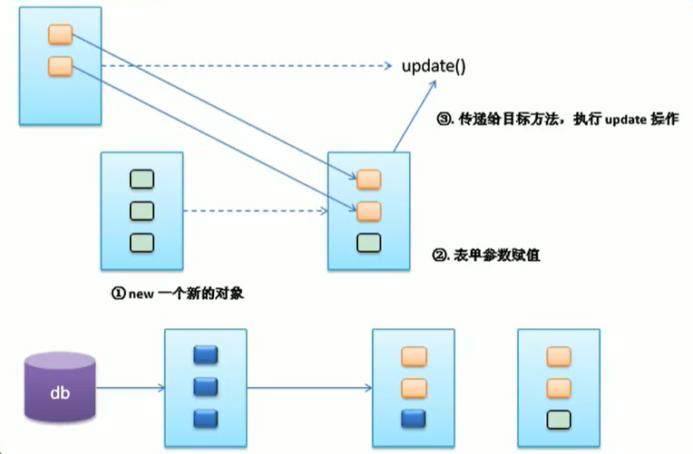
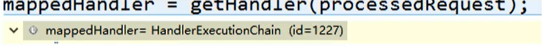

# Spring MVC 

## 一、第一个Spring MVC程序

### Spring框架结构图


- SpringMVC是Spring实现web模块，用于简化web开发

### Spring MVC框架结构图

Spring眼中的MVC在保留以前三者的基础上增加了前端控制器。


### HelloWorld程序

#### 创建动态web工程

Dynamic web model version推荐选择2.5，若选择3.0，则需要勾选上生成web.xml配置文件

#### 导包

核心包+aop（支持注解）+web+webmvc


#### 配置web.xml


```xml
<?xml version="1.0" encoding="UTF-8"?>
<web-app xmlns:xsi="http://www.w3.org/2001/XMLSchema-instance"  xmlns="http://java.sun.com/xml/ns/javaee"  xsi:schemaLocation="http://java.sun.com/xml/ns/javaee  http://java.sun.com/xml/ns/javaee/web-app_3_0.xsd"  id="WebApp_ID" version="3.0">
  <display-name>01_springmvc_helloworld</display-name>
  <welcome-file-list>
    <welcome-file>index.jsp</welcome-file>
  </welcome-file-list>
  <!--SpirngMVC的思想是 有一个前端控制器能拦截所有请求, 并智能派发,  这个前端控制器是一个servlet -->
  <!-- The front controller of this Spring Web application,  responsible for handling all application requests -->
     <servlet>
           <servlet-name>springDispatcherServlet</servlet-name>
           <servlet-class>org.springframework.web.servlet.DispatcherServlet</servlet-class>
           <init-param>
           <!-- contextConfigLocation：指定springMVC配置文件位置  为类路径下的springmvc.xml -->
                <param-name>contextConfigLocation</param-name>
                <param-value>classpath:springmvc.xml</param-value>
           </init-param>
           <!-- servlet启动加载，servlet原本是第一次访问创建对象
            load-on-startup 服务器启动的时候创建对象 值越小优先级越高 越先创建对象 -->
           <load-on-startup>1</load-on-startup>
     </servlet>
     <!-- Map all requests to the DispatcherServlet for  handling -->
     <servlet-mapping>
           <servlet-name>springDispatcherServlet</servlet-name>
           <!--
                /*和/都是拦截所有请求; /不会拦截jsp
                /*的范围更大; 还会拦截到*.jsp这些请求
            -->
           <url-pattern>/</url-pattern>
     </servlet-mapping>
  
</web-app>
```

#### 配置springmvc.xml

在类路径下创建springmvc.xml （spring bean configuration file），namespace中选择 context扫描包组件


```xml
<?xml version="1.0" encoding="UTF-8"?>
<beans xmlns="http://www.springframework.org/schema/beans"
	xmlns:xsi="http://www.w3.org/2001/XMLSchema-instance"
	xmlns:context="http://www.springframework.org/schema/context"
	xsi:schemaLocation="http://www.springframework.org/schema/beans http://www.springframework.org/schema/beans/spring-beans.xsd
		http://www.springframework.org/schema/context http://www.springframework.org/schema/context/spring-context-4.0.xsd">

	<context:component-scan base-package="com.syc.controller"></context:component-scan>
	
	<!-- 配置视图解析器，能帮我们拼接页面地址 -->
	<bean class="org.springframework.web.servlet.view.InternalResourceViewResolver">
		<!-- 视图解析器自动拼串 -->
		<property name="prefix" value="/WEB-INF/pages/"></property>
		<property name="suffix" value=".jsp"></property>
	</bean>
</beans>

```


#### jsp前端页面


#### 处理器Controller


### HelloWold程序补充

#### 1.不指定SpringMVC配置文件

在前面的HelloWorld程序中，我们用初始化参数指定了配置文件所在的位置


若我们没有指定这个文件则会默认去找这个配置文件：/WEB-INF/servlet名-servlet.xml

#### 2.url-pattern的拦截内容

/ 拦截所有请求，不拦截jsp页面

/* 拦截所有请求，拦截jsp页面

- 为什么/会把index.html也拦截？


#### 3.RequestMapping标注在类上

RequestMapping标注在类上，为当前类所有的方法的请求地址指定一个基准路径


## 二、RequestMapping中参数的设置

RequestMaping中的参数包括：**method, params, headers, consumes, prodeces**

### 1.method属性规定请求方式


点击链接是get方式，如果请求方式错误，会报405错误。

**编写jsp页面，以post方式进行请求**

```jsp
<a href="test/handle02">handle02 Get方式不支持</a>
<br/>form表单方式支持post请求
<form action="test/handle02" method="post">
     <input type="submit">
</form>
```

### 2.params属性规定请求参数


```java
	@RequestMapping(value="/handle03",params= {"username=123","pwd","!age"})
	public String handle03() {
		return "success";
	}
```

### 3.headers属性规定请求头

```java
/**
	 * 只能让火狐进行访问
	 * 谷歌
	 * User-Agent:Mozilla/5.0 (Windows NT 10.0; Win64; x64) AppleWebKit/537.36 (KHTML, like Gecko) Chrome/81.0.4044.138 Safari/537.36
	 * Firefox：
	 * Mozilla/5.0 (Windo ws NT 10.0; Win64; x64; rv:71.0) Gecko/20100101 Firefox/71.0
	 * @return
	 */
	@RequestMapping(value="/handle04", headers="User-Agent=Mozilla/5.0 (Windows NT 10.0; Win64; x64; rv:71.0) Gecko/20100101 Firefox/71.0")
	public String handle04() {
		System.out.println("handle04...");
		return "success";
	}
```

### 4.ant风格的url

**编写jsp页面**

```jsp
<h3>Ant风格的url</h3>
<a href="antTest01">精确匹配</a>
<br/>
<a href="antTest02">单字符匹配</a>
```

**编写响应方法**

```java
package com.syc.controller;
import org.springframework.stereotype.Controller;
import org.springframework.web.bind.annotation.PathVariable;
import org.springframework.web.bind.annotation.RequestMapping;
@Controller
public class RequestMappingTest {
     
     /**
      *  Ant 风格资源地址支持 3 种匹配符：【了解】
           ?：匹配文件名中的一个字符
          *：匹配文件名中的任意个字符
          **：** 匹配多层路径
      * @return
      */
     //精确匹配
     @RequestMapping("/antTest01")
     public String antTest01() {
           System.out.println("antTest01 output ...");
           return "success";
     }
     
     //1.匹配一个字符，0个或多个都不行
     @RequestMapping("/antTest0?")
     public String antTest02() {
           System.out.println("antTest02 output ...");
           return "success";
     }
     
     //2.匹配任意多个字符，0个或多个都行
     @RequestMapping("/antTest0*")
     public String antTest03() {
           System.out.println("antTest03 output ...");
           return "success";
     }
     
     //3.匹配一层路径
     @RequestMapping("/a/*/antTest0*")
     public String antTest04() {
           System.out.println("antTest04 output ...");
           return "success";
     }
     
     //4.匹配多层路径，0层或多层
     @RequestMapping("/a/**/antTest0*")
     public String antTest05() {
           System.out.println("antTest05 output ...");
           return "success";
     }
     
}
```

小结：ant风格的url，在能够满足精确匹配的情况下，优先考虑精确匹配

### 5.使用@PathVariable获取路径上的占位符

```java
//路径上可以有占位符，占位符的语法就是可以在任意路径的地方写一个{变量名}
	@RequestMapping("/user/{pwdd}")
	public String pathVariableTest(@PathVariable("pwdd")String pwd) {
		System.out.println("路径上的占位符为：" + pwd);
		return "success";
	}
```

如访问：http://localhost:8080/01_springmvc_helloworld/user/syc

输出： 路径上的占位符为：syc

## 三、Rest风格的URL地址（get, post, put, delete)

**<font color=red>核心思想是：配置filter，这个filter是HiddenHttpMethodFilter</font>**

- 使用Rest风格的url地址，在对资源进行增删改查操作，无需在地址中专门写四个不同的请求方式：GET、POST、PUT、DELETE
- 使用Rest风格地址，需要在web.xml中配置Filter，它可以**把普通形式的请求转化为规定形式的请求**，配置这个filter为 HiddenHttpMethodFilter
- 如何发其他形式的请求？1、创建一个post类型的表单 2、表单携带一个_method的参数 3、这个_method的值就是DELETE、PUT
- Get查询，POST添加，PUT更新，DELETE删除

### 配置web.xml

主要是编写HiddenHttpMethodFilter

```xml
<?xml version="1.0" encoding="UTF-8"?>
<web-app xmlns:xsi="http://www.w3.org/2001/XMLSchema-instance" xmlns="http://java.sun.com/xml/ns/javaee" xsi:schemaLocation="http://java.sun.com/xml/ns/javaee http://java.sun.com/xml/ns/javaee/web-app_3_0.xsd" id="WebApp_ID" version="3.0">
  <display-name>02_springmvc_rest</display-name>
  <welcome-file-list>
    <welcome-file>index.html</welcome-file>
    <welcome-file>index.htm</welcome-file>
    <welcome-file>index.jsp</welcome-file>
    <welcome-file>default.html</welcome-file>
    <welcome-file>default.htm</welcome-file>
    <welcome-file>default.jsp</welcome-file>
  </welcome-file-list>
  <!-- The front controller of this Spring Web application, responsible for handling all application requests -->
	<servlet>
		<servlet-name>springmvc</servlet-name>
		<servlet-class>org.springframework.web.servlet.DispatcherServlet</servlet-class>
		<load-on-startup>1</load-on-startup>
	</servlet>

	<!-- Map all requests to the DispatcherServlet for handling -->
	<servlet-mapping>
		<servlet-name>springmvc</servlet-name>
		<url-pattern>/</url-pattern>
	</servlet-mapping>
	
	<filter>
		<filter-name>HiddenHttpMethodFilter</filter-name>
		<filter-class>org.springframework.web.filter.HiddenHttpMethodFilter</filter-class>
	</filter>
	<filter-mapping>
		<filter-name>HiddenHttpMethodFilter</filter-name>
		<url-pattern>/*</url-pattern>
	</filter-mapping>
</web-app>
```

### jsp前端页面

```jsp
<%@ page language="java" contentType="text/html; charset=UTF-8"
    pageEncoding="UTF-8"%>
<!DOCTYPE html>
<html>
<head>
<meta charset="UTF-8">
<title>Insert title here</title>
</head>
<body>
<!-- 发起图书的增删改查请求，使用Rest风格的URL地址
	从页面发起PUT、DELETE形式的请求
	1）SpringMVC中有一个Filter，它可以把普通形式的请求转化为规定形式的请求，配置这个filter为 HiddenHttpMethodFilter
	2）如何发其他形式的请求？1、创建一个post类型的表单 2、表单携带一个_method的参数 3、这个_method的值就是DELETE、PUT
 -->

<a href="book/1">查询图书</a>
<form action="book" method="post">
	<input type="submit" value="添加图书">
</form>
<form action="book/1" method="post">
	<input name="_method" value="delete">
	<input type="submit" value="删除1号图书">
</form>
<form action="book/1" method="post">
	<input name="_method" value="put">
	<input type="submit" value="更新1号图书">
</form>
</body>
</html>
```

### 控制器类Controller

```java
package com.syc.controller;

import org.springframework.stereotype.Controller;
import org.springframework.web.bind.annotation.PathVariable;
import org.springframework.web.bind.annotation.RequestMapping;
import org.springframework.web.bind.annotation.RequestMethod;

@Controller
public class BookController {
	
	@RequestMapping(value="/book/{bid}", method=RequestMethod.GET)
	public String getBook(@PathVariable("bid")Integer id) {
		System.out.println("查询到了"+id+"号图书");
		return "success";
	}
	@RequestMapping(value="/book/{bid}", method=RequestMethod.DELETE)
	public String deleteBook(@PathVariable("bid")Integer id) {
		System.out.println("删除了"+id+"号图书");
		return "success";
	}
	@RequestMapping(value="/book/{bid}", method=RequestMethod.PUT)
	public String updateBook(@PathVariable("bid")Integer id) {
		System.out.println("更新了"+id+"号图书");
		return "success";
	}
	@RequestMapping(value="/book", method=RequestMethod.POST)
	public String addBook() {
		System.out.println("添加了新的图书");
		return "success";
	}

}
```


输出：


### 源码分析

在HiddenHttpMethodFilter中有一个doFilterInternal方法：


其中的methodParam的值为：


如果请求方式为POST，并且paramValue有值，则将该值转化为大写，并且放到HttpServletRequest中，放行时用wrapper放行，否则直接用request进行放行。

而其中**new HttpMethodRequestWrapper(request, method);** 的具体做法是：获取到传进来的method，然后重写其中的getMethod()方法


### 解决浏览器报错问题

在响应delete和put方法请求时，若使用tomcat8及更高的版本，浏览器页面会报错<font color = red>HTTP Status 405 - JSPs only permit GET POST or HEAD </font>

解决方法：在要跳转的success.jsp中写入isErrorPage="true"

```jsp
<%@ page language="java" contentType="text/html; charset=UTF-8"
    pageEncoding="UTF-8" isErrorPage="true"%>
<!DOCTYPE html>
<html>
<head>
<meta charset="UTF-8">
<title>Insert title here</title>
</head>
<body>
成功
</body>
</html>
```

## 四、Request请求处理

请求处理的方式：

1、默认方式获取请求参数

2、@RequestParam 获取请求参数

3、@RequestHeader 获取请求头信息

4、@CookieValue 获取cookie的JID值

### 1.默认方式获取请求参数

>  直接给方法入参上写一个和请求参数名相同的变量，这个变量就来接受请求参数的值。

>  请求时带了参数：有值；没带参数：null

- jsp页面加上请求参数

```jsp
<a href="handle01?username=syc">Hello</a><br>
```

- 控制器中将参数写在方法中获取，要求参数名要一样

```java
	@RequestMapping("/handle01")
	public String hello(String username) {
		System.out.println("Hello ..." + username);
		return "success";
	}
```

说明：若请求的url为：http://localhost:8080/03_springmvc_request/handle01? 

即在handle01后未添加username参数，则打印的username为null


### 2.@RequestParam等方式

* @RequestParam 获取请求参数值，参数默认是必须带的 
  * value:指定要获取的参数的key
   * required:选择参数是否必须
   * defaultValue:默认值，没带默认是null
* @RequestHeader 获取请求头信息
  * value:指定要获取的参数的key
   * required:选择参数是否必须
   * defaultValue:默认值，没带默认是null
* @CookieValue 获取cookie的JID值（JSESSIONID值，会话关掉，第一次获取的时候没有JSESSIONID的值）

**编写JSP页面代码**

```jsp
<a href="handle02?username=syc">handle02</a><br/>
```

**编写控制器类**

```java
	@RequestMapping("/handle02")
	public String handle02(@RequestParam(value="user", required=false, defaultValue="我没带")String username, 
			@RequestHeader("User-Agent")String userAgent,
			@CookieValue("JSESSIONID")String jid) {
		System.out.println("变量的值："+username);
		System.out.println("请求头中的浏览器信息："+userAgent);
		System.out.println("cookie中的jid的值"+jid);
		return "success";
	}
```

请求地址：http://localhost:8080/03_springmvc_request/handle02?username=syc

该请求对应的输出：


### 3.传入POJO，自动封装

如果请求参数是一个POJO，SpringMVC会自动地为这个POJO进行赋值。

以在jsp表单中添加一本书为例，在后端中获取图书信息

**编写JSP页面**

```jsp
<form action="book" method="post">
	书名：<input type="text" name="bookName"/><br/>
	作者：<input type="text" name="author"/><br/>
	价格：<input type="text" name="price"/><br/>
	库存：<input type="text" name="stock"/><br/>
	销量：<input type="text" name="sales"/><br/>
	<hr/>
    <!-- 级联封装 -->
	省：<input type="text" name="address.CityName"/><br/>
	街道：<input type="text" name="address.Street"/><br/>
	<input type="submit">
</form>
```


**编写图书的POJO**

```java
package com.syc.book;

public class Book {
	/** 
	书名：<input type="text" name="bookName"/><br/>
	作者：<input type="text" name="author"/><br/>
	价格：<input type="text" name="price"/><br/>
	库存：<input type="text" name="stock"/><br/>
	销量：<input type="text" name="sales"/><br/>
	 */
	private String bookName;
	private String author;
	private double price;
	private Integer stock;
	private Integer sales;
	private Address address;
	public String getBookName() {
		return bookName;
	}
	public void setBookName(String bookName) {
		this.bookName = bookName;
	}
	public String getAuthor() {
		return author;
	}
	public void setAuthor(String author) {
		this.author = author;
	}
	public double getPrice() {
		return price;
	}
	public void setPrice(double price) {
		this.price = price;
	}
	public Integer getStock() {
		return stock;
	}
	public void setStock(Integer stock) {
		this.stock = stock;
	}
	public Integer getSales() {
		return sales;
	}
	public void setSales(Integer sales) {
		this.sales = sales;
	}
	
	public Address getAddress() {
		return address;
	}
	public void setAddress(Address address) {
		this.address = address;
	}
	@Override
	public String toString() {
		return "Book [bookName=" + bookName + ", author=" + author + ", price=" + price + ", stock=" + stock
				+ ", sales=" + sales + ", address=" + address + "]";
	}
		
}
```

```java
package com.syc.book;

public class Address {
	private String CityName;
	private String Street;
	public String getCityName() {
		return CityName;
	}
	public void setCityName(String cityName) {
		CityName = cityName;
	}
	public String getStreet() {
		return Street;
	}
	public void setStreet(String street) {
		Street = street;
	}
	@Override
	public String toString() {
		return "Address [CityName=" + CityName + ", Street=" + Street + "]";
	}
	
}
```

**处理响应**

```java
/**
	 * 如果请求参数是一个POJO
	 * SpringMVC会自动地为这个POJO进行赋值
	 * 1、将POJO中的每一个属性，从request参数中尝试获取出来，并封装即可，相当于POJO中有一个参数，便使用RequestParam获取该参数
	 * 2、还可以级联封装：属性的属性
	 * @param book
	 * @return
	 */	
@RequestMapping("/book")
	public String addBook(Book book) {
		System.out.println("我要保存的图书："+book);
		return "success";
	}
```

**响应请求**


#### 解决获取中文时的乱码问题

乱码的分两种情况：

1.请求乱码

​	**GET请求**：**需要修改总的服务器的server.xml**

​	在8080端口的Connector中加入URIEncoding="UTF-8"，即

```
<Connector URIEncoding="UTF-8" connectionTimeout="20000" port="8080" protocol="HTTP/1.1" redirectPort="8443"/>
```

​	**POST请求**：在第一次获取请求参数之前设置request.setCharacterEncoding("UTF-8");

​    也可以**自己写一个filter**，SpringMVC中有这个Filter，是 CharacterEncodingFilter

```xml
<!-- 字符编码的filter最先配置 -->
	<filter>
		<filter-name>CharacterEncodingFilter</filter-name>
		<filter-class>org.springframework.web.filter.CharacterEncodingFilter</filter-class>
		<!-- encoding：指定解决POST请求乱码 -->
		<init-param>
			<param-name>encoding</param-name>
			<param-value>UTF-8</param-value>
		</init-param>
		<init-param>
		<!-- 顺手解决响应乱码:response.setCharacterEncoding(this.encoding); -->
			<param-name>forceEncoding</param-name>
			<param-value>true</param-value>
		</init-param>
	</filter>
	<filter-mapping>
		<filter-name>CharacterEncodingFilter</filter-name>
		<url-pattern>/*</url-pattern>
	</filter-mapping>
```

CharacterEncodingFilter的源码部分：


**<font color="red">小结：</font>**使用SpingMVC前端控制器写完就直接写字符编码过滤器（解决POST请求乱码问题）；对于GET请求的乱码问题，应该是Tomcat一装好，就修改server.xml的8080处添加URIEncoding="UTF-8"；并且设置字符编码的filter应该在其他filter之前，因为要在第一次获取请求参数之前设置字符编码，若其他的filter已经获取请求参数，在此filter之后设置字符编码就无效。

2.响应乱码

响应乱码很好解决：response.setContentType("text/html;charset=utf-8");


### 4.传入原生API

这里的原生API指HttpServletRequest、HttpSession等，直接写在参数中

**请求地址**

http://localhost:8080/03_springmvc_request/handle03

**处理响应**

可以用的原生API主要有三个：HttpServletRequest、HttpServletResponse、HttpSession

```java
/**
	 * SpringMVC可以直接在参数上写原生API，可以写的原生API有如下几个
	 * HttpServletRequest
	 * HttpServletResponse
	 * HttpSession
	 * 
	 * java.security.Principal:https安全协议相关
	 * Locale：国际化有关的区域信息
	 * InputStream:
	 * 	   ServletInputStream inputStream = request.getInputStream();
	 * OutputStream:
	 * 		ServletOutputStream outputStream = response.getOutputStream();
	 * Reader
	 * 		BufferedReader reader = request.getReader();
	 * Writer
	 * 		PrintWriter writer = response.getWriter();
	 * @return
	 */
	@RequestMapping("/handle03")
	public String handle03(HttpSession session, HttpServletRequest request) {
		request.setAttribute("reqParam", "我是请求域中的");
		session.setAttribute("sessionParam", "我是session域中的");
		return "success";
	}
```

**编写跳转成功的JSP页面**

```jsp
<%@ page language="java" contentType="text/html; charset=UTF-8"
    pageEncoding="UTF-8"%>
<!DOCTYPE html>
<html>
<head>
<meta charset="UTF-8">
<title>Insert title here</title>
</head>
<body>
恭喜！
<h1>成功！</h1>
请求：${requestScope.reqParam}<br/>
session: ${sessionScope.sessionParam }<br/>
</body> 
</html>
```

跳转成功


## 五、数据输出

SpringMVC除了在方法上传入原生的request和session外，还有以下的方式把数据带给页面：

### 1.方法处传入Map、Mode 或者ModelMap

给这些参数里面保存的所有数据都会放在**请求域**中，可以在页面中获取。

Map, Model, ModelMap最终使用的都是BindingAwareModelMap

**编写请求页面**

```jsp
<a href="hello">Hello</a><br>
<a href="handle01">handle01请求</a></br>
<a href="handle02">handle02请求</a></br>
<a href="handle03">handle03请求</a></br>
```

**编写响应方法**

```java
package com.syc.controller;

import java.util.Map;

import org.springframework.stereotype.Controller;
import org.springframework.ui.Model;
import org.springframework.ui.ModelMap;
import org.springframework.web.bind.annotation.RequestMapping;

@Controller
public class OutputController {

	@RequestMapping("/handle01")
	public String handle01(Map<String, String> map) {
		map.put("msg", "你好");
		return "success";
	}
	
	@RequestMapping("/handle02")
	public String handle02(Model model) {
		model.addAttribute("msg", "你好啊");
		return "success";
	}
	
	@RequestMapping("/handle03")
	public String handle03(ModelMap modelMap) {
		modelMap.addAttribute("msg", "你好棒");
		return "success";
	}
}

```

编写响应页面

```jsp
<body>
<h1>恭喜！</h1>
pageContext:${pageScope.msg }</br>
request:${requestScope.msg }</br>
session:${sessionScope.msg }</br>
application:${applicationScope.msg }</br>
</body> 
```


**三者底层的关系**

打印出上面三者（map, model, modelmap）的类型都是

class org.springframework.validation.support.BindingAwareModelMap


### 2.方法返回值为ModelAndView

方法的返回值可以变为ModelAndView类型，既包含视图信息(页面地址)也包含模型数据(给页面带的数据) ;
而且数据是放在请求域中；
request、session、application; 三个域请求域用的最频繁

```java
@RequestMapping("/handle04")
	public ModelAndView handle04() {
		ModelAndView mv = new ModelAndView("success");
		mv.addObject("msg", "tm");
		return mv;
	}
```

数据同样是存储在请求域中。上面的代码若是调用无参构造器，则页面可以通过mv.setViewName("success");进行设置。

### 3.使用@SessionAttributes给session域中带数据（了解）

**使用@SessionAttributes的方式给session域中保存数据可能会引发异常，不推荐使用，若一定要给session中保存数据可以使用原生API。**

SpringMVC提供了一种可以临时给Session域中保存数据的方式：使用一个注解  @SessionAttributes (只能标在类上)，@SessionAttributes(value="msg") 给BindingAwareModelMap中保存的数据，或者ModelAndView中保存的数据，同时给sessoin域中保存一份。

```java
@SessionAttributes(value="msg")
@Controller
public class OutputController {

	/*
	 * 方法处传入Map、Mode 或者ModelMap
	 * 三者底层使用的都是：
	 * 	class org.springframework.validation.support.BindingAwareModelMap
	 */
	@RequestMapping("/handle01")
	public String handle01(Map<String, String> map) {
		map.put("msg", "hello");
		System.out.println(map.getClass());
		return "success";
	}
}
```

在类上标注该标签，能够实现在session域中保存。


@SessionAttributes(value={"msg", "text"})可以同时获取保存在msg和text的信息

@SessionAttributes(value={"msg", "text"}, types={String.class})可以获取到所有保存的数据类型为String的数据

**编写响应页面**


**编写响应处理**

```java
@SessionAttributes(value="msg", types={String.class})
@Controller
public class OutputController {

	/*
	 * 方法处传入Map、Mode 或者ModelMap
	 * 三者底层使用的都是：
	 * 	class org.springframework.validation.support.BindingAwareModelMap
	 */
	@RequestMapping("/handle01")
	public String handle01(Map<String, String> map) {
		map.put("msg", "hello");
		map.put("text", "nihao");
		System.out.println(map.getClass());
		return "success";
	}
}
```


### 4.ModelAttribute全字段更新问题（了解）

在修改一条记录时，并不是全字段修改；只会修改部分字段，以修改图书信息为例，需要修改的字段为： 
author， price，stock，sales等，书名bookName不用修改
1)、不修改的字段可以在页面进行展示但是不要提供修改输入框:
2)、为了简单，Controller直接在参数位置来写Book对象
3)、SpringMVC为我们自动封装book; (没有带的值是null)
4)、如果接下来调用了一个全字段更新的dao操作:会将其他的字段可能变为null;




**解决全字段更新问题**

1)、SpringMVC要封装请求参数的Book对象不应该是自己new出来的。而应该是**[从数据库中]**拿到的准备好的对象
2)、再来使用这个对象封装请求参数

**场景，以修改图书信息为例**

编写图书页面

```jsp
<form action="updateBook" method="post">
	<input type="hidden" name="id" value="100"/>
	书名：《Java编程思想》<br/>
	作者：<input type="text" name="author"/><br/>
	价格：<input type="text" name="price"/><br/>
	库存：<input type="text" name="stock"/><br/>
	销量：<input type="text" name="sales"/><br/>
	<input type="submit" value="修改图书">
</form>
```

ModelAttribute解决方法

使用@ModelAttribute提前保存book对象，当需要进行字段值修改时，已经有的值不用修改内容。

```java
package com.syc.controller;

import java.util.Map;

import org.springframework.stereotype.Controller;
import org.springframework.web.bind.annotation.ModelAttribute;
import org.springframework.web.bind.annotation.RequestMapping;

import com.syc.bean.Book;

@Controller
public class ModelAttributeTest {
	
	@RequestMapping("/updateBook")
	public String updateBook(@ModelAttribute("book")Book book) {
		System.out.println("图书信息：" + book);
		return "success";
	}
	
	/**
	 * @ModelAttribute参数
	 * 参数：取出刚才保存的数据
	 * 方法参数：这个方法会提前于目标方法先运行，我们可以在这里提前查出数据库中图书的信息
	 * book中保存图书信息
	 */
	@ModelAttribute
	public void myModelAttribute(Map<String, Object> map) {
		Book book = new Book(100, "《剑指Offer》", "syc", 23.45, 34, 235);
		System.out.println("book信息：" +book);
		map.put("book", book);
		System.out.println("modelAttribute方法...查询图书并保存");
	}

}

```

前端页面需要修改的值：


输出：


方法中的map与ModelAttribute注解中的map实际上是一个map，可以进行测试并打印输出：

```java
package com.syc.controller;

import java.util.Map;

import org.springframework.stereotype.Controller;
import org.springframework.web.bind.annotation.ModelAttribute;
import org.springframework.web.bind.annotation.RequestMapping;

import com.syc.bean.Book;

@Controller
public class ModelAttributeTest {
	Object o1;
	Object o2;
	Book b1;
	Book b2;
	@RequestMapping("/updateBook")
	public String updateBook(@ModelAttribute("book")Book book, Map<String, Object> map) {
		o1 = map;
		Object b1 = map.get("book");
		System.out.println("o1 == o2" + (o1 == o2));
		System.out.println("b1 == book?" + (b1==book));
		System.out.println("图书信息：" + book);
		return "success";
	}
	
	/**
	 * @ModelAttribute参数
	 * 参数：取出刚才保存的数据
	 * 方法参数：这个方法会提前于目标方法先运行，我们可以在这里提前查出数据库中图书的信息
	 * book中保存图书信息
	 */
	@ModelAttribute
	public void myModelAttribute(Map<String, Object> map) {
		Book book = new Book(100, "《剑指Offer》", "syc", 23.45, 34, 235);
		System.out.println("book信息：" +book);
		map.put("book", book);
		o2 = map;
		System.out.println("modelAttribute方法...查询图书并保存");
		System.out.println(map.getClass());
	}

}

```


## 六、SpringMVC源码分析

#### DispatcherServlet结构图


FrameworkServlet中的doGet/doPost方法重写了HttpServlet中的doGet/doPost方法，其中调用processRequest方法，而processRequest方法中，最重要的是一行**doService(request, response);** 

doService方法是FrameworkServlet中的一个抽象方法，必须由子类实现。

DispatcherServlet中重写了doService方法，其中最重要的是doDispatch方法，下面讨论doDispatch方法的详细过程。

#### doDispatch方法详解

```java
protected void doDispatch(HttpServletRequest request, HttpServletResponse response) throws Exception {
		HttpServletRequest processedRequest = request;
		HandlerExecutionChain mappedHandler = null;
		boolean multipartRequestParsed = false;

		WebAsyncManager asyncManager = WebAsyncUtils.getAsyncManager(request);

		try {
			ModelAndView mv = null;
			Exception dispatchException = null;

			try {
                //1.检查是否文件上传请求
				processedRequest = checkMultipart(request);
                //若processedRequest != request，则表示是文件上传请求，设为true
				multipartRequestParsed = processedRequest != request;

				// Determine handler for the current request.
                //2.根据当前的请求地址找到哪个类来处理
				mappedHandler = getHandler(processedRequest);
                
                //3.如果没有找到哪个处理器（控制器）能处理这个请求就404，或者抛异常
				if (mappedHandler == null || mappedHandler.getHandler() == null) {
					noHandlerFound(processedRequest, response);
					return;
				}

				// Determine handler adapter for the current request.
                //4.拿到能执行这个类的所有方法的适配器；（就是一个反射工具）
                //ha 是一个 AnnotationMethodHandlerAdapter
				HandlerAdapter ha = getHandlerAdapter(mappedHandler.getHandler());

				// Process last-modified header, if supported by the handler.
				String method = request.getMethod();
				boolean isGet = "GET".equals(method);
				if (isGet || "HEAD".equals(method)) {
					long lastModified = ha.getLastModified(request, mappedHandler.getHandler());
					if (logger.isDebugEnabled()) {
						String requestUri = urlPathHelper.getRequestUri(request);
						logger.debug("Last-Modified value for [" + requestUri + "] is: " + lastModified);
					}
					if (new ServletWebRequest(request, response).checkNotModified(lastModified) && isGet) {
						return;
					}
				}

				if (!mappedHandler.applyPreHandle(processedRequest, response)) {
					return;
				}

				try {
					// Actually invoke the handler.
                    //5.适配器来执行目标方法，将目标方法执行完成后的返回值作为视图名，设置保存到ModelAndView中，目标方法无论怎么写，最终适配器执行完成都会将执行后的信息封装成ModelAndView
					mv = ha.handle(processedRequest, response, mappedHandler.getHandler());
				}
				finally {
					if (asyncManager.isConcurrentHandlingStarted()) {
						return;
					}
				}

                //如果没有视图名，设置一个默认的视图名
				applyDefaultViewName(request, mv);
				mappedHandler.applyPostHandle(processedRequest, response, mv);
			}
			catch (Exception ex) {
				dispatchException = ex;
			}
            //6.根据方法最终执行完成后封装的ModelAndView，转发到对应页面，而且ModelAndView中的数据可以从请求域中获取
			processDispatchResult(processedRequest, response, mappedHandler, mv, dispatchException);
		}
		catch (Exception ex) {
			triggerAfterCompletion(processedRequest, response, mappedHandler, ex);
		}
		catch (Error err) {
			triggerAfterCompletionWithError(processedRequest, response, mappedHandler, err);
		}
		finally {
			if (asyncManager.isConcurrentHandlingStarted()) {
				// Instead of postHandle and afterCompletion
				mappedHandler.applyAfterConcurrentHandlingStarted(processedRequest, response);
				return;
			}
			// Clean up any resources used by a multipart request.
			if (multipartRequestParsed) {
				cleanupMultipart(processedRequest);
			}
		}
	}
```

核心的两步：

执行目标方法：**mv = ha.handle(processedRequest, response, mappedHandler.getHandler());**

跳转到页面：**processDispatchResult(processedRequest, response, mappedHandler, mv, dispatchException);**

**请求处理的流程步骤：**

1. 所有请求过来DispatcherServlet收到请求

2. 调用doDispatch()方法进行处理
   1)、**getHandler():** 根据当前请求地址找到能处理这个请求的目标处理器类(处理器)

   ​			根据当前请求在HandlerMapping中找到这个请求的映射信息，获取到目标处理器类

   2)、**getHandlerAdapter():** 根据当前处理器类获取到能执行这个处理器方法的适配器

   ​			根据当前处理器类，找到当前类的HandlerAdapter (适配器)

   3)、使用刚才获取到的适配器(AnnotationMethodHandlerAdapter)执行目标方法
   4)、目标方法执行后会返回一个ModelAndView对象
   5)、根据ModelAndView的信息转发到具体的页面，并可以在请求域中取出ModelAndView中的模型数据

#### getHandler()细节

如何根据当前请求找到哪个类来处理

getHandler()会返回目标执行器的执行链




getHandler方法具体详情

```java
protected HandlerExecutionChain getHandler(HttpServletRequest request) throws Exception {
		for (HandlerMapping hm : this.handlerMappings) {
			if (logger.isTraceEnabled()) {
				logger.trace(
						"Testing handler map [" + hm + "] in DispatcherServlet with name '" + getServletName() + "'");
			}
			HandlerExecutionChain handler = hm.getHandler(request);
			if (handler != null) {
				return handler;
			}
		}
		return null;
	}
```

HandleMapping：处理器映射，里面保存了每一个处理器能处理哪些请求的映射信息。


handleMap：IOC容器启动创建Controller对象的时候扫描每个处理器都能处理什么请求，保存在HandlerMapping的handlerMap属性中：下一次请求过来，就来看哪个HandlerMapping中有这个请求映射信息就行了。


#### getHandlerAdapter()细节

如何找到目标处理器的适配器，要拿适配器才去执行目标方法


AnnotatioinMethodHandlerAdapter：能解析注解方法的适配器；处理器类中只要有标了注解的这些方法就能用

#### SpringMVC的九大组件

DispatcherServlet中有几个引用类型的属性: SpringMVC的九大组件;
SpringMVC在工作的时候，关键位置都是由这些组件完成的；
共同点:九大组件全部都是接口；接口就是规范：提供了非常强大的扩展性。

```java
	/** 文件上传解析器 */
	private MultipartResolver multipartResolver;

	/** 区域信息解析器，和国际化有关 */
	private LocaleResolver localeResolver;

	/** ThemeResolver used by this servlet */
	/** 主题解析器，强大的主题效果更换 */
	private ThemeResolver themeResolver;

	/** List of HandlerMappings used by this servlet */
	/** Handler映射信息 */	
	private List<HandlerMapping> handlerMappings;

	/** Handler的适配器 */
	private List<HandlerAdapter> handlerAdapters;

	/** SpringMVC强大的异常解析功能，异常解析器 */
	private List<HandlerExceptionResolver> handlerExceptionResolvers;

	/** RequestToViewNameTranslator used by this servlet */
	/** 将请求地址转换成视图名 */
	private RequestToViewNameTranslator viewNameTranslator;

	/** FlashMapManager used by this servlet */
	/** FlashMap+Manager： SpringMVC中允许重定向携带数据的功能 */
	private FlashMapManager flashMapManager;

	/** 视图解析器 */
	private List<ViewResolver> viewResolvers;
```

**九大组件初始化**

DispatchServlet中九大组件初始化的地方：

```java
protected void initStrategies(ApplicationContext context) {
		initMultipartResolver(context);
		initLocaleResolver(context);
		initThemeResolver(context);
		initHandlerMappings(context);
		initHandlerAdapters(context);
		initHandlerExceptionResolvers(context);
		initRequestToViewNameTranslator(context);
		initViewResolvers(context);
		initFlashMapManager(context);
	}
```

以initHandlerMappings()为例

```java
private void initHandlerMappings(ApplicationContext context) {
		this.handlerMappings = null;

    	//detectAllHandlerMapping默认是true，可以在web.xml中修改属性的默认配置
		if (this.detectAllHandlerMappings) {
			// Find all HandlerMappings in the ApplicationContext, including ancestor contexts.
			Map<String, HandlerMapping> matchingBeans =
					BeanFactoryUtils.beansOfTypeIncludingAncestors(context, HandlerMapping.class, true, false);
			if (!matchingBeans.isEmpty()) {
				this.handlerMappings = new ArrayList<HandlerMapping>(matchingBeans.values());
				// We keep HandlerMappings in sorted order.
				OrderComparator.sort(this.handlerMappings);
			}
		}
		else {
			try {
				HandlerMapping hm = context.getBean(HANDLER_MAPPING_BEAN_NAME, HandlerMapping.class);
				this.handlerMappings = Collections.singletonList(hm);
			}
			catch (NoSuchBeanDefinitionException ex) {
				// Ignore, we'll add a default HandlerMapping later.
			}
		}

		// Ensure we have at least one HandlerMapping, by registering
		// a default HandlerMapping if no other mappings are found.
        // 没有找到就采用默认的配置
		if (this.handlerMappings == null) {
			this.handlerMappings = getDefaultStrategies(context, HandlerMapping.class);
			if (logger.isDebugEnabled()) {
				logger.debug("No HandlerMappings found in servlet '" + getServletName() + "': using default");
			}
		}
	}
```

小结：组件的初始化:去容器中找这个组件,如果没有找到就用默认的配置;

寻找组件时，有些是用类型去找，有些是用ID去找。

#### handle()锁定目标方法的执行

mv = ha.handle(processedRequest, response, mappedHandler.getHandler());执行目标方法的细节

在该方法中最重要的是return invokeHandlerMethod(request, response, handler);

```java
	protected ModelAndView invokeHandlerMethod(HttpServletRequest request, HttpServletResponse response, Object handler)
			throws Exception {

        //拿到方法解析器
		ServletHandlerMethodResolver methodResolver = getMethodResolver(handler);
        //方法解析器根据当前请求地址找到真正的目标方法
		Method handlerMethod = methodResolver.resolveHandlerMethod(request);
		//创建一个方法执行器
        ServletHandlerMethodInvoker methodInvoker = new ServletHandlerMethodInvoker(methodResolver);
        //包装原生的request, response
		ServletWebRequest webRequest = new ServletWebRequest(request, response);
        //创建了一个隐含模型
		ExtendedModelMap implicitModel = new BindingAwareModelMap();
		//真正执行目标方法：目标方法利用反射执行期间确定参数值，提前执行modelattribute等所有操作都在这个方法中
		Object result = methodInvoker.invokeHandlerMethod(handlerMethod, handler, webRequest, implicitModel);
		ModelAndView mav =
				methodInvoker.getModelAndView(handlerMethod, handler.getClass(), result, implicitModel, webRequest);
		methodInvoker.updateModelAttributes(handler, (mav != null ? mav.getModel() : null), implicitModel, webRequest);
		return mav;
	}

```

#### invokeHandlerMethod方法

```java
public final Object invokeHandlerMethod(Method handlerMethod, Object handler,
			NativeWebRequest webRequest, ExtendedModelMap implicitModel) throws Exception {

		Method handlerMethodToInvoke = BridgeMethodResolver.findBridgedMethod(handlerMethod);
		try {
			boolean debug = logger.isDebugEnabled();
            
			for (String attrName : this.methodResolver.getActualSessionAttributeNames()) {
				Object attrValue = this.sessionAttributeStore.retrieveAttribute(webRequest, attrName);
				if (attrValue != null) {
					implicitModel.addAttribute(attrName, attrValue);
				}
			}
            //找到所有@ModelAttribute注解标注的方法
			for (Method attributeMethod : this.methodResolver.getModelAttributeMethods()) {
				Method attributeMethodToInvoke = BridgeMethodResolver.findBridgedMethod(attributeMethod);
                //先确定modelattribute方法执行时要使用的每一个参数的值
				Object[] args = resolveHandlerArguments(attributeMethodToInvoke, handler, webRequest, implicitModel);
				if (debug) {
					logger.debug("Invoking model attribute method: " + attributeMethodToInvoke);
				}
				String attrName = AnnotationUtils.findAnnotation(attributeMethod, ModelAttribute.class).value();
				if (!"".equals(attrName) && implicitModel.containsAttribute(attrName)) {
					continue;
				}
				ReflectionUtils.makeAccessible(attributeMethodToInvoke);
				Object attrValue = attributeMethodToInvoke.invoke(handler, args);
				if ("".equals(attrName)) {
					Class<?> resolvedType = GenericTypeResolver.resolveReturnType(attributeMethodToInvoke, handler.getClass());
					attrName = Conventions.getVariableNameForReturnType(attributeMethodToInvoke, resolvedType, attrValue);
				}
				if (!implicitModel.containsAttribute(attrName)) {
					implicitModel.addAttribute(attrName, attrValue);
				}
			}
			Object[] args = resolveHandlerArguments(handlerMethodToInvoke, handler, webRequest, implicitModel);
			if (debug) {
				logger.debug("Invoking request handler method: " + handlerMethodToInvoke);
			}
			ReflectionUtils.makeAccessible(handlerMethodToInvoke);
			return handlerMethodToInvoke.invoke(handler, args);
		}
		catch (IllegalStateException ex) {
			// Internal assertion failed (e.g. invalid signature):
			// throw exception with full handler method context...
			throw new HandlerMethodInvocationException(handlerMethodToInvoke, ex);
		}
		catch (InvocationTargetException ex) {
			// User-defined @ModelAttribute/@InitBinder/@RequestMapping method threw an exception...
			ReflectionUtils.rethrowException(ex.getTargetException());
			return null;
		}
	}
```

## 七、视图解析

说明：有前缀的转发和重定向操作，配置的视图解析器不会进行拼串。

### forward前缀完成转发操作

在当前项目下（WebContent下）有一个hello.jsp，如何使转发操作跳到该页面(不采用字符串拼串的方式)

使用 **forward: **前缀可以转发到一个绝对路径

```java
package com.syc.controller;

import org.springframework.stereotype.Controller;
import org.springframework.web.bind.annotation.RequestMapping;

@Controller
public class HelloController {
	
	//方法一：使用相对路径，../../回退两层
	@RequestMapping("/hello")
	public String Hello() {
		System.out.println("Hello...");
//		return "success";
		//采用相对路径的写法
		return "../../hello";
	}
	
	//方法二：使用forward转发
	/**
	 * forward:转发到一个页面
	 *  /hello.jsp转发到当前项目下的hello.jsp
	 * @return
	 */
	@RequestMapping("handle01")
	public String handle01() {
		System.out.println("handle01处理");
		return "forward:/hello.jsp";
	}
	
	//转发到handle01请求
	/**
	 * forward:/handle01转发到handle01请求
	 * @return
	 */
	@RequestMapping("handle02")
	public String handle02() {
		System.out.println("handle02处理");
		return "forward:/handle01";
	}
}

```

注：当使用forward转发时，不会有我们配置的视图解析器拼串；若是转发到另一个请求，则会对两个方法进行打印输出。

### redirect前缀完成重定向操作

**转发和重定向的区别**

转发：当我们通过handle01请求转发到另一个页面时（比如hello.jsp），地址栏的地址并不会发生变化

http://localhost:8080/05_springmvc_viewResolver/handle01，但是页面已经发生了变化

重定向：地址栏发生了变化，http://localhost:8080/05_springmvc_viewResolver/hello.jsp

**小结**：转发：通过handle01请求转发到jsp页面，地址栏仍然是handle01；重定向：通过handle03请求重定向到jsp页面，地址栏发生了变化，显示的是jsp。

```java
	/**
	 *   重定向到hello.jsp
	 *   重定向 redirect:重定向的路径
	 *   /hello.jsp 从当前项目开始，SpringMVC会为路径自动的拼接上项目名
	 *   
	 *   原生的Servlet重定向/路径需要加上项目名才能成功
	 *   response.sendRedirect("项目名/hello.jsp")
	 *   
	 * @return
	 */
	@RequestMapping("handle03")
	public String handle03() {
		System.out.println("handle03处理");
		return "redirect:/hello.jsp"; 
	}

	//handle04先转发到handle03，然后handle03又转发到jsp
	@RequestMapping("handle04")
	public String handle04() {
		System.out.println("handle04处理");
		return "redirect:/handle03"; 
	}
```

### jstlView支持国际化

导包导入了jstl的时候会自动创建为一个jstIView ;可以快速方便的支持国际化功能


1）、javaWeb国际化步骤;（了解）
		1)、得到一一个Locale对象;
		2)、使用ResourceBundle绑定国际化资源文件 ;
		3)、使用ResourceBundle.getString("key") ;获取到国际化配置文件中的值;
		4)、web页面的国际化, fmt标签库来做;
				< fmt:setLocale>
				< fmt:setBundle >
				< fmt:message>
2）、有了JstlView以后;
		1)、让Spring管理国际化资源文件就行
		2)、直接去页面使用**<fmt:message >**;

**编写处理响应方法**

```java
@RequestMapping("/tologin")
	public String login() {
		System.out.println("跳转到登录页面");
		return "login";
	}
```

通过tologin请求，直接转发到login.jsp

该页面内容如下：

```jsp
<%@ page language="java" contentType="text/html; charset=UTF-8"
    pageEncoding="UTF-8"%>
<!-- fmt标签库 -->
<%@ taglib prefix="fmt" uri="http://java.sun.com/jsp/jstl/fmt"%>
<!DOCTYPE html>
<html>
<head>
<meta charset="UTF-8">
<title>Insert title here</title>
</head>
<body>
<h2>
<fmt:message key="welcomeinfo"></fmt:message>
</h2>
<form action="">
	<fmt:message key="username"/>:<input /><br/>
	<fmt:message key="password"/>:<input /><br/>
	<input type="submit" value='<fmt:message key="loginBtn"/>'>
</form>
</body>
</html>
```

**创建国际化资源文件**

在项目下创建源码文件夹conf，然后创建两个资源文件


英文资源文件：

```properties
welcomeinfo=WELCOME TO SPRINGMVC
username=USERNAME
password=PASSWORD
loginBtn=LOGIN
```

中文资源文件

```properties
welcomeinfo=欢迎来到Springmvc
username=用户名
password=密码
loginBtn=登录
```

配置Spring配置文件

```xml
<!--让SpringMVC管理国际化资源文件，配置一个资源文件管理器  
		它要起作用，要求是id必须是messageSource
	-->
	<bean id="messageSource" class="org.springframework.context.support.ResourceBundleMessageSource">
		<!-- basename指定基础名  -->
		<property name="basename" value="i18n"></property>
	</bean>
```


## 八、RestfulCRUD操作

利用SpringMVC做一个CRUD(增删改查)，并且符合Rest风格。

C：create创建；R：retrieve查询； U：update更新；D：Delete删除

**业务场景：**

程序中有员工和部门，数据存储在map集合中，通过Restful的URL实现对员工信息的新增、修改、删除等操作。

即**对于URL为：/emp/1，Get请求对应查询员工操作，Put请求对应更新操作，Delete请求对应删除操作，对于URL为/emp：Post请求对应添加操作。**


### 查询所有

过程：访问index.jsp---直接转发到/emps请求---控制器查询所有员工---放在请求域中---转发到list页面展示

index.jsp直接转发到emps请求

```jsp
<%@ page language="java" contentType="text/html; charset=UTF-8"
    pageEncoding="UTF-8"%>
<!-- 访问项目就要展示员工类别页面 -->
<jsp:forward page="/emps"></jsp:forward>
```

控制器查询所有员工信息保存在请求域中

```java
package com.syc.controller;

import java.util.Collection;

import org.springframework.beans.factory.annotation.Autowired;
import org.springframework.stereotype.Controller;
import org.springframework.ui.Model;
import org.springframework.web.bind.annotation.RequestMapping;

import com.syc.bean.Employee;
import com.syc.dao.EmployeeDao;

@Controller
public class EmployeeController {
	
	@Autowired
	EmployeeDao employeeDao;
	
	@RequestMapping("/emps")
	public String getEmps(Model model) {
		Collection<Employee> all = employeeDao.getAll();
		model.addAttribute("emps",all);
		return "list";
	}

}

```

转发到list.jsp页面

```jsp
<%@ page language="java" contentType="text/html; charset=UTF-8"
    pageEncoding="UTF-8"%>
 <!-- 导入jstl的核心库 -->
<%@ taglib prefix="c" uri="http://java.sun.com/jsp/jstl/core"%>
<!DOCTYPE html>
<html>
<head>
<meta charset="UTF-8">
<title>员工列表</title>
</head>
<body>
<h2>员工列表</h2>
<!-- cellpadding 表格单元格中文字举例边框的举例，cellspacing两个单元格之间的距离 -->
<table border="1" cellpadding="5" cellspacing="0">
	<tr>
		<th>ID</th>
		<th>lastName</th>
		<th>email</th>
		<th>gender</th>
		<th>departmentName</th>
		<th>EDIT</th>
		<th>DELETE</th>
	</tr>
	<c:forEach items="${emps }" var="emp">
	<!-- 每个员工就是一行 tr -->
	<tr>
		<td>${emp.id}</td>
		<td>${emp.lastName}</td>
		<td>${emp.email}</td>
		<td>${emp.gender==0?"女":"男"}</td>
		<td>${emp.department.departmentName}</td>
		<td>EDIT</td>
		<td>DELETE</td>
	</tr>
	</c:forEach>	
</table>
</body>
</html>
```


### 添加员工

在list页面点击"员工添加" ---（查询出所有的部门信息要展示在页面）---来到添加页面( add.jsp ) ------输入员工数据------点击保存-----处理器收到
员工保存请求(保存员工) -----保存完成以后还是来到列表页面; |

**处理响应**

将查询出来的所有员工添加到请求域

```java
@RequestMapping("/toaddpage")
	public String toaddpage(Model model) {
		Collection<Department> departments = departmentDao.getDepartments();
		model.addAttribute("depts", departments);
		return "add";
	}
```

**请求转发到添加页面**

```jsp
<%@ page language="java" contentType="text/html; charset=UTF-8"
    pageEncoding="UTF-8"%>
<%@taglib prefix="c" uri="http://java.sun.com/jsp/jstl/core" %>
<!DOCTYPE html>
<html>
<head>
<meta charset="UTF-8">
<title>Insert title here</title>
</head>
<body>
<h2>添加员工</h2>
<form action="">
	lastName:<input type="text" name="lastName"/><br/>
	email:<input type="text" name="email"/><br/>
	gender: <br/> 
		男：<input type="radio" name="gender" value="1"/><br/>
		女：<input type="radio" name="gender" value="0"/><br/>
	dept:
		<select name="department.id"><!-- 需要保存的 -->
			<c:forEach items="${depts}" var="deptItem">
				<!--在标签体中的是在页面的提示信息，value才是真正提交的值-->
				<option value="${deptItem.id}">${deptItem.departmentName}</option>
			</c:forEach>
		</select>
	<input type="submit" value="提交"/>	
</form>
</body>
</html>
```

#### 表单标签技术

通过SpringMVC的表单标签可以实现将模型数据中的属性和HTML表单元素相绑定，以实现表单数据更便捷编辑和表单值的回显

**响应请求逻辑**

```java
@RequestMapping("/toaddpage")
	public String toaddpage(Model model) {
		Collection<Department> departments = departmentDao.getDepartments();
		model.addAttribute("depts", departments);
		model.addAttribute("employee", new Employee(null,"张三", "test@163.com", 0, departmentDao.getDepartment(101)));
		return "add";
	}
```

这里在请求域中放入employee，原本默认放入的是command，在添加时，**new一个空的Employee对象**即可。

**使用表单标签的jsp**

```jsp
<h2>添加员工</h2>
<!--
表单标签：
	通过SpringMVC的表单标签可以实现将模型数据中的属性和HTML表单元素相绑定，
	以实现表单数据更便捷编辑和表单值的回显
	1)、SpringMVC认为，表单数据中的每一项最终都是要回显的，
	path指定的是一个属性: 这个属性是从隐含模型(请求域)中取出的某个对象中的属性;
	path指定的每一个属性，请求域中必须有一个对象，拥有这个属性:
		这个对象就是请求域中的Command;
		modelAttribute=""
		1）以前表单标签会从请求域中获取一个command对象，把这个对象中的每一个属性对应的显示出来
		2）可以告诉SpringMVC不要去取command的值了，放了一个modelAttribute指定的
		取对象用的key就用modelAttribute指定的
			
  -->
<form:form action="" modelAttribute="employee">
<!--path就是原来html-input的name项，需要写
		path：1）原生的name项
		2）自动回显隐含模型中某个对象对应的这个属性值
  -->
	lastname:<form:input path="lastName"/><br/>
	email:<form:input path="email"/><br/>
	gender:<br/>
		男：<form:radiobutton path="gender" value="1"/><br/>
		女：<form:radiobutton path="gender" value="0"/><br/>
	dept:
		<!-- 
		items="";指定要遍历的集合；自动遍历；遍历出的每一个元素是一个department对象
		itemLabel="属性名":指定遍历出的这个对象的哪个属性是作为option标签体的值
		itemValue="属性名":指定刚才遍历出来的这个对象的哪个属性是作为要提交的value值
		-->
		<form:select path="department.id" 
		items="${depts}" 
		itemLabel="departmentName" 
		itemValue="id"></form:select><br/>
	<input type="submit" value="保存"/>
</form:form>
```

**点击保存按钮进行保存**

```jsp
 <%
 	pageContext.setAttribute("crud", request.getContextPath());
 %>
<form:form action="${crud}/emp" modelAttribute="employee" method="post">
```

修改表单的action为当前项目的/emp，当点击保存提交后，发出/emp请求，请求方法为post

**编写请求响应**

```java
@RequestMapping(value="/emp", method=RequestMethod.POST)
	public String addEmp(Employee employee) {
		System.out.println("要添加的员工："+employee);
		employeeDao.save(employee);
		return "redirect:/emps";
		
	}	
```

保存表单之后，重定向到/emps，查询出员工信息并展示。

### 修改员工


### 删除员工

