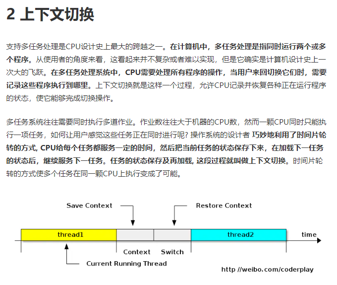
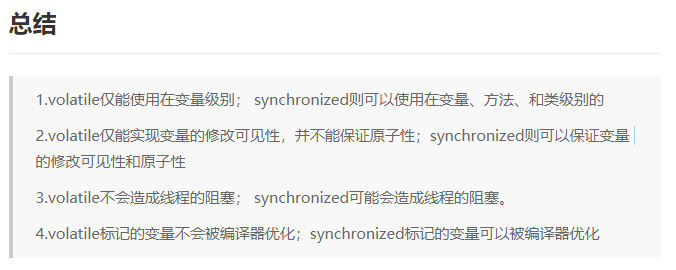
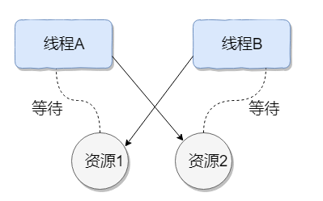
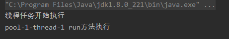
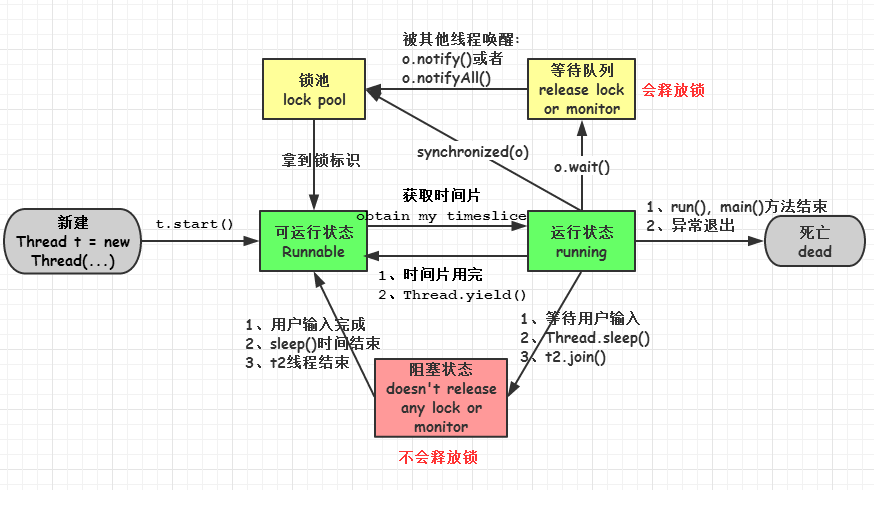

并发编程

## 为什么要使用并发编程？

1. 充分利用多核CPU的计算能力
2. 方便进行业务拆分，提升系统并发能力和性能

## 并发编程的缺点？

**内存泄露、上下文切换、线程安全、死锁**

### 内存泄露

1. 内存泄露：虽然无法访问的对象内存不会再被使用，但是却不会被JVM回收

   举例：（1）**长生命周期的对象持有短生命周期的引用**

   作用域过大造成的内存泄露

   ```java
   public class Simple {
       private Object object;
       public void method() {
           object = new Object();
           // ...
       }
   }
   
   ```

   在上面的代码中，object对象只能在method方法中使用，在整个类的生命周期中，object 所占用的空间虽然都不会被再次使用，但却始终无法得以回收。

   **改进：在object = new Object( ); 之后使用object = null;**

   （2）容器元素造成的内存泄露

   ```java
   public E pop(){
       if(size == 0)
           return null;
       else
           return (E) elementData[--size];
   }
   
   ```

   size 变小导致 ArrayList 中原有的末端元素将永远得不到使用，但是由于容器持有着他们的引用，他们也永远得不到释放。

   改进：

   ```java
   E e = (E) elementData[--size];
   elementData[size] = null;
   return e;
   ```

   ### 上下文切换

2. 上下文切换

   https://juejin.im/post/5b10e53b6fb9a01e5b10e9be

   

   概括起来：当前任务在执行完 CPU 时间片切换到另一个任务之前会先保存自己的状态，以便下次再切换回这个任务时，可以再加载这个任务的状态。**任务从保存到再加载的过程就是一次上下文切换**。

3. 线程安全

4. 死锁

## 并发编程三要素

**原子性、可见性、有序性**

### 原子性

原子性：原子，即一个不可再被分割的颗粒。原子性指的是一个或多个操作要么全部执行成功要么全部执行失败。

### 可见性

可见性：一个线程对共享变量的修改,另一个线程能够立刻看到。（synchronized,volatile）

### 有序性

有序性：程序执行的顺序按照代码的先后顺序执行。（处理器可能会对指令进行重排序）

**volatile与synchronized的区别**：https://juejin.im/post/5ae134e76fb9a07acb3c8ea7

（1）volatile修饰的变量具有可见性

```java
package test;

public class RunThread extends Thread {

    private volatile boolean isRunning = true;

    public boolean isRunning() {
        return isRunning;
    }

    public void setRunning(boolean isRunning) {
        this.isRunning = isRunning;
    }

    @Override
    public void run() {
        System.out.println("进入到run方法中了");
        while (isRunning == true) {
        }
        System.out.println("线程执行完成了");
    }
}

class Run {
    public static void main(String[] args) {
        try {
            RunThread thread = new RunThread();
            System.out.println(thread.isRunning());
            thread.start();
            Thread.sleep(10);//当前线程暂停
            thread.setRunning(false);//线程会一直在私有堆栈中读取isRunning变量,RunThread线程无法读到main线程改变的isRunning变量,该情形称为“活性失败”
        } catch (InterruptedException e) {
            e.printStackTrace();
        }
    }
}

```

（2）volatile禁止指令重排

指令重排：CPU和编译器为了提升程序执行的效率，会按照一定的规则允许进行指令优化，在某些情况下，这种优化会带来一些执行的逻辑问题

```java
package test;

public class MyThread extends Thread {
    public volatile static int count;

    private static void addCount() {
        for (int i = 0; i < 100; i++) {
            count++;
        }
        System.out.println("count=" + count);
    }

    @Override
    public void run() {
        addCount();
    }
}

class Run1 {

    /**
     * i+1的操作分为三步：读取i，i的值+1，将i值写会内存
     * volatile修饰的变量并不能保证线程的原子性
     * 当后一个线程要对变量进行+1操作，因为前一个线程还没来得及将结果返回，因此会导致读到的是无效的数据
     * @param args
     */
    public static void main(String[] args) {
        MyThread[] mythreadArray = new MyThread[100];
        for (int i = 0; i < 100; i++) {
            mythreadArray[i] = new MyThread();
        }

        for (int i = 0; i < 100; i++) {
            mythreadArray[i].start();
        }
    }
}

```

**仅靠volatile不能保证线程的安全性。**

synchronized可作用于一段代码或方法，既可以保证可见性，又能够保证原子性。

- 可见性体现在：通过synchronized或者Lock能保证同一时刻只有一个线程获取锁然后执行同步代码，并且在释放锁之前会将对变量的修改刷新到主存中。

- 原子性表现在：要么不执行，要么执行到底。



## Java程序中如何保证多线程的运行安全？

**出现线程安全问题的原因：**

1. 线程切换带来的原子性问题
2. 缓存导致的可见性问题
3. 编译优化带来的有序性问题

**解决办法：**

JDK Atomic开头的原子类、synchronized、LOCK，可以解决原子性问题
synchronized、volatile、LOCK，可以解决可见性问题
Happens-Before 规则可以解决有序性问题

## 并行与并发的区别

并发：多个任务在单个CPU核上按照时间片轮转（交替）执行，并没有完全意义上的“同时执行”

并行：多个处理器或多核处理器同时处理多个任务，是真正意义上的“同时进行”。


## 进程和线程的区别

1. 进程是资源分配的最小单位，线程是CPU调度的最小单位
2. .进程中可以包含多个线程，但至少包含一个线程，进程的执行过程不是单条线的，而是多个线程（多条线）共同完成，线程又被称为轻权进程或者轻量级进程
3. 地址空间：进程拥有独立的地址空间，多个线程共享本进程的地址空间；资源拥有：进程之间的资源是独立的，同一进程内的线程共享本进程的资源，如内存
4. 进程间切换的开销大，每个进程有独立的代码和数据空间；线程间切换开销小，同一类线程共享代码和数据空间，每个线程有自己独立的运行栈和程序计数器
5. 进程崩溃后，在保护模式下不会对其他进程产生影响，但是一个线程崩溃整个进程都会崩溃，多进程比多线程健壮
6. 进程能独立执行，线程不能独立执行，必须依存在进程中，由应用程序提供多个线程执行控制，两者均可并发执行


## 守护线程和用户线程的区别

用户线程：运行在前台，执行具体的任务，如程序的主线程，连接网络的子线程等

守护线程：以后台方式运行，为其他线程服务，守护线程是非守护线程的“佣人”，一旦所有的用户线程结束，守护线程也自动结束，如GC线程。

**守护线程的注意事项**

1. setDaemon(true)必须在start()方法前执行，否则会抛出 IllegalThreadStateException 异常
2. 在守护线程中产生的新线程也是守护线程
3. 不是所有的任务都可以分配给守护线程来执行，比如读写操作或者计算逻辑
4. 守护 (Daemon) 线程中不能依靠 finally 块的内容来确保执行关闭或清理资源的逻辑。因为我们上面也说过了一旦所有用户线程都结束运行，守护线程会随 JVM 一起结束工作，所以守护 (Daemon) 线程中的 finally 语句块可能无法被执行。


## 线程死锁

死锁是指两个或两个以上的进程（线程）在执行过程中，由于竞争资源或者由于彼此通信而造成的一种阻塞的现象，若无外力作用，它们都将无法推进下去。此时称系统处于死锁状态或系统产生了死锁，这些永远在互相等待的进程（线程）称为死锁进程（线程）。



线程 A 持有资源 2，线程 B 持有资源 1，他们同时都想申请对方的资源，所以这两个线程就会互相等待而进入死锁状态。


**形成死锁的四个必要条件** 

synchronized (Object o)，线程获得对象O

1. 互斥条件：线程(进程)对于所分配到的资源具有排它性，即**一个资源只能被一个线程(进程)占用**，直到被该线程(进程)释放
2. 请求与保持条件：一个线程(进程)因请求被占用资源而发生阻塞时，**对已获得的资源保持不放**。
3. 不剥夺条件：线程(进程**)已获得的资源在末使用完之前不能被其他线程强行剥夺**，只有自己使用完毕后才释放资源。
4. 循环等待条件：当发生死锁时，所等待的线程(进程)必定会形成一个环路（类似于死循环），造成永久阻塞

**如何避免线程死锁**

破坏互斥条件：这个条件我们没有办法破坏，因为我们用锁本来就是想让他们互斥的（临界资源需要互斥访问）。

破坏请求与保持条件：一次性申请所有的资源。

破坏不剥夺条件：占用部分资源的线程进一步申请其他资源时，如果申请不到，可以主动释放它占有的资源。

破坏循环等待条件：靠按序申请资源来预防。按某一顺序申请资源，释放资源则反序释放。破坏循环等待条件。

## 创建线程的方式

**继承Thread类、实现Runnable接口、实现Collable接口、使用Executors工具类创建线程池**

### 继承Thread类

### 实现Runnable接口

> 步骤：
>
> 1.定义MyRunable类实现Runable接口，重写run()方法；
>
> 2.创建MyRunable实例myRunable，以myRunable作为target创建Thread对象thread，该对象才是真正的线程对象；
>
> 3.调用线程对象的start()方法。

```java
public class RunnableTest {

    public static void main(String[] args) {
        MyRunnable myRunnable = new MyRunnable();
        Thread thread = new Thread(myRunnable);
        thread.start();
        System.out.println(Thread.currentThread().getName() + " main()方法执行完成");
    }
}
```


### 实现Collable接口

> 步骤：
>
> 1.定义MyCollable类实现Collable接口，重写call方法，该方法有返回值，返回值类型为Collable接口规定的泛型；
>
> 2.以myCollable为参数创建FutureTask对象
>
> 3.以futureTask为参数创建Thread对象
>
> 4.调用线程对象的start方法

```java
package test;

import java.util.concurrent.Callable;
import java.util.concurrent.ExecutionException;
import java.util.concurrent.FutureTask;

public class MyCallable implements Callable {
    @Override
    public Object call() throws Exception {
        System.out.println(Thread.currentThread().getName() + " call方法执行中...");
        String str = new String("abc");
        return str;
    }
}

class CallableTest {
    public static void main(String[] args) throws InterruptedException, ExecutionException {
        MyCallable myCallable = new MyCallable();
        FutureTask futureTask = new FutureTask(myCallable);
        Thread thread = new Thread(futureTask);
        thread.start();

        Thread.sleep(1000);
        System.out.println("返回结果：" + futureTask.get());
        System.out.println(Thread.currentThread().getName() + " main方法执行完成");
    }
}

```

### 使用Executors工具类创建线程池

> 步骤：
>
> 1.创建MyRunnable类实现Runnable接口
>
> 2.使用Executors的newSingleThreadExecutor方法（还有newFixedThreadPool，newCachedThreadPool，newSingleThreadExecutor，newScheduledThreadPool）创建线程池
>
> 3.执行线程池的execute方法，传入myRunnable对象
>
> 4.执行线程池的shutdown方法

```java
package test;

import java.util.concurrent.ExecutorService;
import java.util.concurrent.Executors;

public class MyRunnable implements Runnable {

    @Override
    public void run() {
        System.out.println(Thread.currentThread().getName() + " run方法执行");
    }
}

class SingleThreadExecutorTest {
    public static void main(String[] args) {
        ExecutorService executorService = Executors.newSingleThreadExecutor();
        MyRunnable runableTest = new MyRunnable();
        executorService.execute(runableTest);
        System.out.println("线程任务开始执行");
        executorService.shutdown();
    }
}

```



## Runnable和Callable的区别

**相同点**

1.都是接口

2.都是使用thread.start()的方式启动线程

**不同点**

1.Runnable接口的run方法无返回值，Callable的call方法有返回值，是个泛型，和Future、FutureTask配合可以获得异步执行的结果

2.Runnalbe接口的run方法只能抛出运行时异常，无法捕获异常，Callable接口的call方法允许抛出异常，可以获取异常信息。


### 调用start方法和run方法的区别

1.调用start方法会使线程处于就绪状态，当分到时间片后就开始运行了，start() 会执行线程的相应准备工作，然后自动执行 run() 方法的内容，这是真正的多线程工作。

2.直接执行run方法，会把run方法当成一个main线程下的普通方法区执行，并不会在某个线程中执行它，并不是真正的多线程。

总结： 调用 start 方法方可启动线程并使线程进入就绪状态，而 run 方法只是 thread 的一个普通方法调用，还是在主线程里执行。


## 线程的五种状态

**新建、就绪、运行、阻塞、死亡**

- 新建状态：线程对象被创建，进入新建状态，Thread thread = new Thread();

- 就绪状态：也被称为可运行状态，线程对象创建后，其他线程调用该对象的start()方法，从而启动该线程。处于就绪状态的线程，随时可能被CPU调度执行（分到CPU时间片）

- 运行状态：线程获取CPU时间片，执行程序代码。只能从就绪状态进入运行状态

- 阻塞状态：线程因为某种原因放弃CPU使用权，暂时停止运行。直到线程进入就绪状态，才有机会转到运行状态。

  (1) 等待阻塞 -- 通过调用线程的wait()方法，让线程等待某工作的完成。

  (2) 同步阻塞 -- 线程在获取synchronized同步锁失败(因为锁被其它线程所占用)，它会进入同步阻塞状态。

  (3) 其他阻塞 -- 通过调用线程的sleep()或join()或发出了I/O请求时，线程会进入到阻塞状态。当sleep()状态超时、join()等待线程终止或者超时、或者I/O处理完毕时，线程重新转入就绪状态。

- 死亡状态：线程run()、main（）方法执行结束，或者因为异常退出了run()方法，该线程结束生命周期，死亡的线程不可再复生。



## 线程调度算法

分时调度：所有的线程轮流获得CPU的使用权，并且平均分配每个线程占用的 CPU 的时间片

抢占式调度：优先让可运行池中优先级高的线程占用CPU，如果可运行池中的线程优先级相同，那么久随机选择一个线程，使其占用CPU。处于运行状态的线程会一直运行，直至它不得不放弃 CPU。

**线程的调度策略**

线程终止运行的情况：

（1）线程体中调用了**yield**方法让出了CPU的占用权

（2）线程体中调用了 **sleep** 方法使线程进入睡眠状态

（3）线程由于 IO 操作受到阻塞

（4）另外一个更高优先级线程出现

（5）在支持时间片的系统中，该线程的时间片用完

**线程同步与线程调度相关的方法**

（1） wait()：使一个线程处于等待（阻塞）状态，并且释放所持有的对象的锁；

（2）sleep()：使一个正在运行的线程处于睡眠状态，是一个静态方法，调用此方法要处理 InterruptedException 异常；

（3）notify()：唤醒一个处于等待状态的线程，当然在调用此方法的时候，并不能确切的唤醒某一个等待状态的线程，而是由 JVM 确定唤醒哪个线程，而且与优先级无关；

（4）notityAll()：唤醒所有处于等待状态的线程，该方法并不是将对象的锁给所有线程，而是让它们竞争，只有获得锁的线程才能进入就绪状态；


## 线程sleep方法和wait方法的区别

1. sleep方法是线程类的静态方法，wait方法是Object类的方法
2. sleep方法不释放锁、wait方法释放锁
3. wait方法通常用于线程间交互，sleep通常用于暂停执行
4. wait方法调用后，线程不会自动苏醒，需要别的线程调用同一个对象上的notify或者notifyAll方法；sleep方法完成后，线程会自动苏醒。

