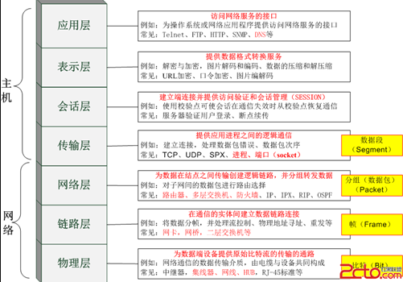
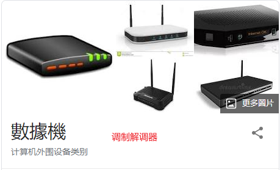

## 设计模式七大原则

1.单一职责原则（一个类只负责一项职责；类中方法足够少时，可以在方法级别保持单一职责原则）

2.接口隔离原则（客户端不应该依赖它不需要的接口）

3.依赖倒转原则（抽象不应该依赖细节，细节依赖抽象；面向接口编程；多态；人接收邮箱和微信信息）

4.迪米特法则（最少知道原则，一个类对自己依赖的类知道的越少越好）

5.开闭原则（对扩展开放，对修改关闭；多态）

6.里式替换原则（加减运算程序引发的问题和思考，子类尽量不要重写父类的方法，父类和子类都继承一个更通俗的基类，采用依赖，聚合，组合等关系替换原有的直接继承关系）

7.合成复用原则（尽量使用合成、聚成，而不是使用继承）


## 设计模式有哪几种？

设计模式有23种，分为三大类：**创建型、结构性、行为型**

创建型中有**单例模式**（分饿汉式、懒汉式）、**工厂模式**（分简单工厂模式、工厂方法模式、抽象工厂模式）等；

结构型模式中有**装饰模式**、**代理模式**等；

行为型模式有**观察者模式**、**模板方法模式**等。


### 1.单例模式

### 单例模式-饿汉式（*）

**步骤：**

1. 构造器私有化 (防止 new )
2. 类的内部创建对象
3. 向外暴露一个静态的公共方法。getInstance

```java
//饿汉式(静态常量)
class Singleton {
	
	//1. 构造器私有化, 外部不能new
	private Singleton() {
		
	}
	
	//2.类的内部创建对象实例
	private final static Singleton instance = new Singleton();
	
	//3. 向外暴露一个静态的公共方法，返回实例对象
	public static Singleton getInstance() {
		return instance;
	}
	
}
```

**优点：**类装载的时候完成实例化，避免了线程同步问题。

**缺点：**没有达到懒加载的效果，如果至始至终都没有使用过这个实例，可能会造成内存浪费。

### 单例模式-懒汉式（双重检查）（*）

使用volatile和synchronized保证线程安全

```java
// 双重检查
class Singleton {
	private static volatile Singleton instance;
	
	private Singleton() {}
	
	//提供一个静态的公有方法，加入双重检查代码，解决线程安全问题, 同时解决懒加载问题
	//同时保证了效率, 推荐使用
	public static Singleton getInstance() {
		if(instance == null) {
			synchronized (Singleton.class) {
				if(instance == null) {
					instance = new Singleton();
				}
			}
			
		}
		return instance;
	}
}
```

**优点：**线程安全；延迟加载；效率较高

### 单例模式-静态内部类方式

```java
// 静态内部类完成， 推荐使用
class Singleton {
	private static volatile Singleton instance;
	
	//构造器私有化
	private Singleton() {}
	
	//写一个静态内部类,该类中有一个静态属性 Singleton
	private static class SingletonInstance {
		private static final Singleton INSTANCE = new Singleton(); 
	}
	
	//提供一个静态的公有方法，直接返回SingletonInstance.INSTANCE
	public static synchronized Singleton getInstance() {
		return SingletonInstance.INSTANCE;
	}
}
```

优点：保证了线程安全，利用静态内部类特点实现延迟加载，效率高

### 单例模式-在JDK中的应用

**JDK中的Runtime类用的就是单例模式中的饿汉式**


### 单例模式-使用场景

需要**频繁的进行创建和销毁**的对象、创建对象时耗时过多或耗费资源过多(即：重量级对象），但又经常用到的对象、工具类对象、频繁访问数据库或文件的对象(比如**数据源**、**session 工厂**等)

### 2.工厂模式

### 工厂模式-简单工厂模式（*）

简单工厂模式是由一个**工厂对象决定创建出哪一种产品类的实例**。定义了一个创建对象的类，由这个类来**封装实例化对象的行为**，在简单工厂模式中，无需修改客户端的代码。

简单工厂类：

```java
public class SimpleFactory {
 
	//根据orderType 返回对应的Pizza 对象
	public static Pizza createPizza(String orderType) {
 
		Pizza pizza = null;
 
		System.out.println("使用简单工厂模式");
		if (orderType.equals("greek")) {
			pizza = new GreekPizza();
			pizza.setName(" 希腊披萨 ");
		} else if (orderType.equals("cheese")) {
			pizza = new CheesePizza();
			pizza.setName(" 奶酪披萨 ");
		} else if (orderType.equals("pepper")) {
			pizza = new PepperPizza();
			pizza.setName("胡椒披萨");
		}
		return pizza;
	}
}
```

客户端代码无需修改：

```java
public class OrderPizza {
 
	Pizza pizza = null;
	String orderType = "";
 
	public OrderPizza() {
		
		do {
			orderType = getType();
			pizza = SimpleFactory.createPizza(orderType);
 
			// 输出pizza
			if (pizza != null) { // 订购成功
				pizza.prepare();
				pizza.bake();
				pizza.cut();
				pizza.box();
			} else {
				System.out.println(" 订购披萨失败 ");
				break;
			}
		} while (true);
	}
 
	// 写一个方法，可以获取客户希望订购的披萨种类
	private String getType() {
		try {
			BufferedReader strin = new BufferedReader(new InputStreamReader(System.in));
			System.out.println("input pizza 种类:");
			String str = strin.readLine();
			return str;
		} catch (IOException e) {
			e.printStackTrace();
			return "";
		}
	}
}
```

测试：new OrderPizza();

### 工厂模式-工厂方法模式

定义了一个创建对象的**抽象方法**，由子类决定要实例化的类。工厂方法模式**将对象的实例化推迟到子类**。

```java
public abstract class OrderPizza {
 
	//定义一个抽象方法，createPizza , 让各个工厂子类自己实现
	abstract Pizza createPizza(String orderType);
	
	// 构造器
	public OrderPizza() {
		Pizza pizza = null;
		String orderType; // 订购披萨的类型
		do {
			orderType = getType();
			pizza = createPizza(orderType); //抽象方法，由工厂子类完成
			//输出pizza 制作过程
			pizza.prepare();
			pizza.bake();
			pizza.cut();
			pizza.box();
			
		} while (true);
	}
 
    pulbic String getType(){
        //参考以上简单工厂...
    }
}
```

BJOrderPizza和LDOrderPizza继承该类

```java
public class BJOrderPizza extends OrderPizza {
 
	@Override
	Pizza createPizza(String orderType) {
	
		Pizza pizza = null;
		if(orderType.equals("cheese")) {
			pizza = new BJCheesePizza();
		} else if (orderType.equals("pepper")) {
			pizza = new BJPepperPizza();
		}
		return pizza;
	}
 
}
```

测试：new BJOrderPizza();

### 工厂模式-抽象工厂模式（*）

定义了一个 **interface** 用于创建相关或有依赖关系的对象簇，而无需指明具体的类

抽象工厂模式可以将**简单工厂模式和工厂方法模式进行整合**

接口：

```java
public interface AbsFactory {
	//让下面的工厂子类来 具体实现
	public Pizza createPizza(String orderType);
}
```

BJFactory和LDFactory：

```java
public class BJFactory implements AbsFactory {
 
	@Override
	public Pizza createPizza(String orderType) {
		System.out.println("~使用的是抽象工厂模式~");
		Pizza pizza = null;
		if(orderType.equals("cheese")) {
			pizza = new BJCheesePizza();
		} else if (orderType.equals("pepper")){
			pizza = new BJPepperPizza();
		}
		return pizza;
	}
 
}
```

OrderPizza类

```java
public class OrderPizza {
 
	AbsFactory factory;
 
	// 构造器
	public OrderPizza(AbsFactory factory) {
		setFactory(factory);
	}
 
	private void setFactory(AbsFactory factory) {
		Pizza pizza = null;
		String orderType = ""; // 用户输入
		this.factory = factory;
		do {
			orderType = getType();
			// factory 可能是北京的工厂子类，也可能是伦敦的工厂子类
			pizza = factory.createPizza(orderType);
			if (pizza != null) { // 订购ok
				pizza.prepare();
				pizza.bake();
				pizza.cut();
				pizza.box();
			} else {
				System.out.println("订购失败");
				break;
			}
		} while (true);
	}
 
	// 写一个方法，可以获取客户希望订购的披萨种类
	private String getType() {
		try {
			BufferedReader strin = new BufferedReader(new InputStreamReader(System.in));
			System.out.println("input pizza 种类:");
			String str = strin.readLine();
			return str;
		} catch (IOException e) {
			e.printStackTrace();
			return "";
		}
	}
}
```

测试：new OrderPizza(new LDFactory());

### 工厂模式在JDK中的应用

JDK中的Calender类，使用到了简单工厂模式


### 工厂模式的意义

将**实例化对象的代码提取出来**，放到一个类中统一管理和维护，达到和主项目的依赖关系的解耦。从而提高项目的扩展和维护性。

### 3.装饰者模式

- 装饰器模式（Decorator Pattern）允许向一个现有的对象添加新的功能，同时又不改变其结构。这种类型的设计模式属于结构型模式，它是作为现有的类的一个包装。这种模式创建了一个装饰类，用来包装原有的类，并在保持类方法签名完整性的前提下，提供了额外的功能。

- 装饰者模式是动态的将新功能附加到对象上。在对象功能扩展方面，它比继承更有弹性，装饰者模式也体现了开闭原则(ocp)。
- 装饰者模式使用**继承+组合**的方式

**装饰者模式的设计方案**


抽象类：

```java
package com.syc.decorator;

public abstract class Drink {

	public String des; // 描述
	private float price = 0.0f;
	public String getDes() {
		return des;
	}
	public void setDes(String des) {
		this.des = des;
	}
	public float getPrice() {
		return price;
	}
	public void setPrice(float price) {
		this.price = price;
	}
	
	//计算费用的抽象方法
	//子类来实现
	public abstract float cost();
	
}

```

抽象层：

```java
package com.syc.decorator;

public class Coffee  extends Drink {

	@Override
	public float cost() {
		return super.getPrice();
	}
}

```

美式咖啡：

```java
package com.syc.decorator;

public class LongBlack extends Coffee {

	public LongBlack() {
		setDes(" longblack ");
		setPrice(5.0f);
	}
}

```

意大利咖啡：

```java
package com.syc.decorator;

public class Espresso extends Coffee {
	
	public Espresso() {
		setDes("意大利咖啡 ");
		setPrice(6.0f);
	}
}

```

装饰器类：

```java
package com.syc.decorator;

public class Decorator extends Drink {
	private Drink obj;
	
	public Decorator(Drink obj) { //组合
		this.obj = obj;
	}
	
	@Override
	public float cost() {
		// getPrice 自己价格
		return super.getPrice() + obj.cost();
	}
	
	@Override
	public String getDes() {
		// obj.getDes() 输出被装饰者的信息
		return des + " " + getPrice() + " && " + obj.getDes();
	}
}

```

调料牛奶：

```java
package com.atguigu.decorator;

public class Milk extends Decorator {

	public Milk(Drink obj) {
		super(obj);
		setDes(" 牛奶 ");
		setPrice(2.0f); 
	}
}

```

调料豆浆：

```java
package com.atguigu.decorator;

public class Soy extends Decorator{

	public Soy(Drink obj) {
		super(obj);
		setDes(" 豆浆  ");
		setPrice(1.5f);
	}
}

```

测试类：

```java
package com.syc.decorator;

public class CoffeeBar {

	public static void main(String[] args) {
		// 装饰者模式下的订单：2份巧克力+一份牛奶的LongBlack

		// 1. 点一份 LongBlack
		Drink order = new LongBlack();
		System.out.println("费用1=" + order.cost());
		System.out.println("描述=" + order.getDes());

		// 2. order 加入一份牛奶
		order = new Milk(order);

		System.out.println("order 加入一份牛奶 费用 =" + order.cost());
		System.out.println("order 加入一份牛奶 描述 = " + order.getDes());

		// 3. order 加入一份巧克力
		order = new Chocolate(order);

		System.out.println("order 加入一份牛奶 加入一份巧克力  费用 =" + order.cost());
		System.out.println("order 加入一份牛奶 加入一份巧克力 描述 = " + order.getDes());

		// 3. order 加入一份巧克力
		order = new Chocolate(order);

		System.out.println("order 加入一份牛奶 加入2份巧克力   费用 =" + order.cost());
		System.out.println("order 加入一份牛奶 加入2份巧克力 描述 = " + order.getDes());
	
		System.out.println("===========================");
		
		Drink order2 = new DeCaf();
		
		System.out.println("order2 无因咖啡  费用 =" + order2.cost());
		System.out.println("order2 无因咖啡 描述 = " + order2.getDes());
		
		order2 = new Milk(order2);
		
		System.out.println("order2 无因咖啡 加入一份牛奶  费用 =" + order2.cost());
		System.out.println("order2 无因咖啡 加入一份牛奶 描述 = " + order2.getDes());
	}
}


```


### 装饰者模式在JDK中的应用

在JDK的源码中，InputStream使用的就是装饰者模式，其中InputString是抽象类（如Drink类），FilterInputStream是装饰者（如上面的Decorator），DataInputStream是FilterInputStream的子类（如上面的Milk）


测试类：


### 4.代理模式

### 代理模式-静态代理

静态代理在使用时，需要定义接口或者父类，被代理对象与代理对象需要一起实现相同的接口或者是继承相同的父类。

案例：教师教书，在teach()方法前后分别做额外的处理

类图如下：


接口：

```java
public interface ITeacherDao {
    public void teach();
}
```

实现类：

```java
public class TeacherDao implements ITeacherDao {

    @Override
    public void teach() {
        System.out.println("教师教书");
    }
}
```

代理类：

```java
public class TeacherDaoProxy implements ITeacherDao {

    private ITeacherDao teacherDao;

    public TeacherDaoProxy(ITeacherDao teacherDao) {
        this.teacherDao = teacherDao;
    }

    @Override
    public void teach() {
        System.out.println("前处理");
        teacherDao.teach();
        System.out.println("后处理");
    }
}
```

客户端测试类：

```java
public class Client {
    public static void main(String[] args) {
        //创建目标对象
        TeacherDao teacherDao = new TeacherDao();

        //创建代理对象
        TeacherDaoProxy teacherDaoProxy = new TeacherDaoProxy(teacherDao);

        teacherDaoProxy.teach();
    }
}
```


缺点：一旦接口中增加方法，目标对象与代理对象都要维护

### 代理模式-动态代理

1）在动态代理中，代理对象不需要实现接口，但是目标对象要实现接口，否则不能用动态代理

2）代理对象的生成，利用JDK中的反射机制，动态的在内存中构建代理对象

3）JDK实现代理只需要使用newProxyInstance方法，需要接收三个参数：

ClassLoader、Interfaces 以及InvocationHandler

接口：

```java
public interface ITeacherDao {
    public void teach();
}
```

实现类：

```java
public class TeacherDao implements ITeacherDao {
    @Override
    public void teach() {
        System.out.println("教师教书中");
    }
}
```

**代理工厂类：**

```java
public class ProxyFactory {

    private Object target;

    public ProxyFactory(Object target) {
        this.target = target;
    }

    public Object getProxyInstance(){
        return Proxy.newProxyInstance(target.getClass().getClassLoader(),target.getClass().getInterfaces(), new InvocationHandler() {
            @Override
            public Object invoke(Object proxy, Method method, Object[] args) throws Throwable {
                System.out.println("处理前");
                Object invokeVal = method.invoke(target, args);
                System.out.println("处理后");
                return invokeVal;
            }
        });
    }
}
```

客户端测试类：

```java
public class Client {
    public static void main(String[] args) {
        //创建目标对象
        ITeacherDao teacherDao = new TeacherDao();

        //创建代理对象
        ProxyFactory proxyFactory = new ProxyFactory(teacherDao);

        ITeacherDao instance = (ITeacherDao) proxyFactory.getProxyInstance();
        instance.teach();
    }
}
```

### 代理模式-Cglib

Cglib代理也叫作子类代理，不需要实现某个类。

目标类：

```java
package com.atguigu.proxy.cglib;

public class TeacherDao {

	public void teach() {
		System.out.println(" 老师授课中  ， 我是cglib代理，不需要实现接口 ");
	}
}

```

代理工厂类：

实现MethodInterceptor接口，重写intercept方法

```java
package com.atguigu.proxy.cglib;

import java.lang.reflect.Method;

import net.sf.cglib.proxy.Enhancer;
import net.sf.cglib.proxy.MethodInterceptor;
import net.sf.cglib.proxy.MethodProxy;

public class ProxyFactory implements MethodInterceptor {

	//维护一个目标对象
	private Object target;
	
	//构造器，传入一个被代理的对象
	public ProxyFactory(Object target) {
		this.target = target;
	}

	//返回一个代理对象:  是 target 对象的代理对象
	public Object getProxyInstance() {
		//1. 创建一个工具类
		Enhancer enhancer = new Enhancer();
		//2. 设置父类
		enhancer.setSuperclass(target.getClass());
		//3. 设置回调函数
		enhancer.setCallback(this);
		//4. 创建子类对象，即代理对象
		return enhancer.create();
		
	}
	

	//重写  intercept 方法，会调用目标对象的方法
	@Override
	public Object intercept(Object arg0, Method method, Object[] args, MethodProxy arg3) throws Throwable {
		System.out.println("Cglib代理模式 ~~ 开始");
		Object returnVal = method.invoke(target, args);
		System.out.println("Cglib代理模式 ~~ 提交");
		return returnVal;
	}

}

```

客户端测试类：

```java
package com.atguigu.proxy.dynamic;

public class Client {

	public static void main(String[] args) {
		// TODO Auto-generated method stub
		//创建目标对象
		ITeacherDao target = new TeacherDao();
		
		//给目标对象，创建代理对象, 可以转成 ITeacherDao
		ITeacherDao proxyInstance = (ITeacherDao)new ProxyFactory(target).getProxyInstance();
	
		// proxyInstance=class com.sun.proxy.$Proxy0 内存中动态生成了代理对象
		System.out.println("proxyInstance=" + proxyInstance.getClass());
		
		//通过代理对象，调用目标对象的方法
		//proxyInstance.teach();
		
		proxyInstance.sayHello(" tom ");
	}

}

```


### 5.观察者模式

观察者模式用于定义对象间的一种一对多的依赖关系，当一个对象的状态发生改变时，所有依赖于它的对象都得到通知并被自动更新。当对象间存在一对多关系时，则使用观察者模式（Observer Pattern）。比如，当一个对象被修改时，则会自动通知依赖它的对象。观察者模式属于行为型模式。

**观察者模式原理图**


在观察者模式中，有一个WeatherData核心类，还有一个Observer观察者接口，需要将Observer写到WeatherData中，其中的Subject为接口，提供注册观察者，移除观察者和通知观察者三个主要的方法，由WeatherData来具体实现。Observer为接收输入，可以通过第三方具体实现。


WeatherData：

```java
package com.atguigu.observer.improve;

import java.util.ArrayList;

/**
 * 类是核心
 * 1. 包含最新的天气情况信息 
 * 2. 含有 观察者集合，使用ArrayList管理
 * 3. 当数据有更新时，就主动的调用   ArrayList, 通知所有的（接入方）就看到最新的信息
 * @author Administrator
 *
 */
public class WeatherData implements Subject {
	private float temperatrue;
	private float pressure;
	private float humidity;
	//观察者集合
	private ArrayList<Observer> observers;
	
	//加入新的第三方

	public WeatherData() {
		observers = new ArrayList<Observer>();
	}

	public float getTemperature() {
		return temperatrue;
	}

	public float getPressure() {
		return pressure;
	}

	public float getHumidity() {
		return humidity;
	}

	public void dataChange() {
		//调用 接入方的 update
		
		notifyObservers();
	}

	//当数据有更新时，就调用 setData
	public void setData(float temperature, float pressure, float humidity) {
		this.temperatrue = temperature;
		this.pressure = pressure;
		this.humidity = humidity;
		//调用dataChange， 将最新的信息 推送给 接入方 currentConditions
		dataChange();
	}

	//注册一个观察者
	@Override
	public void registerObserver(Observer o) {
		// TODO Auto-generated method stub
		observers.add(o);
	}

	//移除一个观察者
	@Override
	public void removeObserver(Observer o) {
		// TODO Auto-generated method stub
		if(observers.contains(o)) {
			observers.remove(o);
		}
	}

	//遍历所有的观察者，并通知
	@Override
	public void notifyObservers() {
		// TODO Auto-generated method stub
		for(int i = 0; i < observers.size(); i++) {
			observers.get(i).update(this.temperatrue, this.pressure, this.humidity);
		}
	}
}


```

Observer接口：

```java
package com.atguigu.observer.improve;

//观察者接口，有观察者来实现
public interface Observer {

	public void update(float temperature, float pressure, float humidity);
}

```

第三方接入：

```java
package com.syc.observer.improve;

public class CurrentConditions implements Observer {

	// 温度，气压，湿度
	private float temperature;
	private float pressure;
	private float humidity;

	// 更新 天气情况，是由 WeatherData 来调用，我使用推送模式
	public void update(float temperature, float pressure, float humidity) {
		this.temperature = temperature;
		this.pressure = pressure;
		this.humidity = humidity;
		display();
	}

	// 显示
	public void display() {
		System.out.println("***Today mTemperature: " + temperature + "***");
		System.out.println("***Today mPressure: " + pressure + "***");
		System.out.println("***Today mHumidity: " + humidity + "***");
	}
}
```

测试类：

```java
package com.syc.observer.improve;

public class Client {

	public static void main(String[] args) {
		// TODO Auto-generated method stub
		//创建一个WeatherData
		WeatherData weatherData = new WeatherData();
		
		//创建观察者
		CurrentConditions currentConditions = new CurrentConditions();
		BaiduSite baiduSite = new BaiduSite();
		
		//注册到weatherData
		weatherData.registerObserver(currentConditions);
		weatherData.registerObserver(baiduSite);
		
		//测试
		System.out.println("通知各个注册的观察者, 看看信息");
		weatherData.setData(10f, 100f, 30.3f);
		
		
		weatherData.removeObserver(currentConditions);
		//测试
		System.out.println();
		System.out.println("通知各个注册的观察者, 看看信息");
		weatherData.setData(10f, 100f, 30.3f);
	}

}
```

### 观察者模式在JDK中的应用

JDK中的Observable类就使用了观察者模式


这里的Observable相当于气象台，而Observer就相当于观察者接口，Observable中提供的方法如下：


而在Observer中同样是提供了一个update方法


若我们需要使用观察者模式，可以直接将某个类继承自Observable类。

### 6.模板方法模式

**模板方法模式简介**

1）模板方法模式(Template Method Pattern)，又叫模板模式(Template Pattern)，在一个抽象类公开定义了执行它的方法的模板。它的子类可以按需要重写方法实现，但调用将以抽象类中定义的方式进行。
2）简单说， 模板方法模式定义一个操作中的算法的骨架，而将一些**步骤延迟到子类**中，使得子类可以不改变一个算法的结构，就可以重定义该算法的某些特定步骤
3）这种类型的设计模式属于行为型模式。

以读书这个操作为例，读书的操作有读书前准备，开始读选好的书，读书后，三个步骤，前后两个步骤对于不同的书的操作都是一样的，只有中间阅读的书不一样。

**具体代码：**

书本类

```java
package test.design.template;

public abstract class Book {

   final void readBookStart(){
        prepare();
        readBook();
        endRead();
    }

    void prepare(){
        System.out.println("读书前的准备");
    }

    abstract void readBook();

    void endRead(){
        System.out.println("结束阅读");
    }
}
```

西游类：

```java
package test.design.template;

public class XiYouBook extends Book{


    @Override
    void readBook() {
        System.out.println("读西游记");
    }
}

```

红楼类：

```java
package test.design.template;

public class HongLouBook extends Book {
    @Override
    void readBook() {
        System.out.println("读红楼");
    }
}

```

客户端：

```java
package test.design.template;

public class Client {
    public static void main(String[] args) {
        System.out.println("-----开始读西游戏喽------");
        Book xiYou = new XiYouBook();
        xiYou.readBookStart();

        System.out.println("-----开始读红楼梦喽------");
        Book hongLou = new HongLouBook();
        hongLou.readBookStart();
    }
}

```

### 模板方法模式中的钩子方法

在模板方法模式的父类中，我们可以定义一个方法，它默认不做任何事，子类可以视情况要不要覆盖它，该方法称为“钩子”。

在上述的案例中，如果我们想省略掉中间一步选书的过程，那么可以按照下面的代码实现

在父类中添加是否需要选书的方法，并且默认返回true表示要选书

```java
package test.design.template;

public abstract class Book {

   final void readBookStart(){
        prepare();
        if(needSelectBook()){
            readBook();
        }
        endRead();
    }

    void prepare(){
        System.out.println("读书前的准备");
    }

    abstract void readBook();

    void endRead(){
        System.out.println("结束阅读");
    }

    boolean needSelectBook(){
        return true;
    }
}

```

若我们需要选书，则重写其中的是否需要选书的方法，并返回false

```java
package test.design.template;

public class PureBook extends Book {

    @Override
    void readBook() {
    }

    boolean needSelectBook(){
        return false;
    }
}

```

客户端实现

```java
package test.design.template;

public class Client {
    public static void main(String[] args) {
        System.out.println("-----开始读西游戏喽------");
        Book xiYou = new XiYouBook();
        xiYou.readBookStart();

        System.out.println("-----开始读红楼梦喽------");
        Book hongLou = new HongLouBook();
        hongLou.readBookStart();

        System.out.println("-----读空书-------");
        Book pureBook = new PureBook();
        pureBook.readBookStart();
    }
}

```


### 模板方法方式在Spring IOC 中的应用


### 字节

## OSI七层模型

第一层到第七层：

**物理层、数据链路层、网络层、传输层、会话层、表示层、应用层**




**各层设备：**

物理层：网卡、网线、**集线器、中继器、调制解调器**

数据链路层：**网桥、交换机**

网络层：路由器

运输层：网关

### 物理层

1. 物理层：实现**比特流的透明传输**；物理层定义了数据传送与接收所需要的电与光信号、线路状态、时钟基准、数据编码和电路等，并向数据链路层设备提供标准接口。（设备有：网卡（同时工作在数据链路层）、网线、**集线器**（将多条以太网双绞线或光纤集合连接在同一段物理介质下的设备，对接收到的信号进行再生整形放大，以扩大网络的传输距离；集线器中一个口收到的信号，原封不动的发送给所有其他的口，由其他的口上的设备自己决定是否接收信号）、**中继器**（将输入信号增强放大的模拟设备，把信号送的更远，以延展网络长度）、**调制解调器**（俗称猫，将数字信号调变到模拟信号上进行传输，并解调收到的模拟信号以得到数字信号，以便信号通过电话线传输）




### 数据链路层

2. 数据链路层：数据链路层提供寻址机构、数据帧的构建、**数据差错检查**、**传送控制**、向网络层提供标准的数据接口等功能；将IP数据报组装成**帧**。设备用：**网桥**（网桥的功能在延长网络跨度上类似于中继器，然而它能提供智能化连接服务，即根据帧的终点地址处于哪一网段来进行转发和滤除。网桥对站点所处网段的了解是靠**“自学习”**实现的）、**交换机**

   网桥：


交换机：


### 网络层

3. 网络层：在发送数据时候，网络层把运输层产生的报文段或用户数据报封装成**分组**或**包**进行传送。**网络层的核心是路由器的功能。**比如**路由**（规划线路），**存储**（当路由器接收包的速度要小于它转发包的作用时候，他就会把暂时发送不了的包缓存在自己的缓冲区里面，直到前面的都发出去再将其发出去，这就是存储。）、**转发**、**拥塞控制**、**呼叫准入**（比如左边主机想传一个大的视频文件给右边的主机，但是网络这个时候非常拥挤很难传送。首先左主机先发送一个控制包给右主机，这个控制包说明了自己视频数据所需要的带宽等等信息，那么这个包所途径的路由器都会首先查看自己能不能满足这个需求，如果不能就返回一个不能的信息，如果能就按照路由表向右主机传送。所以一旦有一个路由器不能提供这个服务，那么呼叫建立就失败了，否则只要所以路由器许可，才能传送。）


### 传输层

4. 传输层：负责向两个主机中进程之间的通信提供服务，传输层的数据单元为**数据包**，TCP的数据单元称为**段**，而UDP协议的数据单元称为“**数据报**”。运输层主要使用两种协议：传输控制协议TCP（面向连接的，可靠的交付）、用户数据报协议UDP（无连接的、尽最大努力的交付）

   传输层的作用：（1）多路复用和分用。复用：当传输层从应用程序接收报文后要封装在传输层的段中再交给网络层发送。分用：当传输层从网络层接收数据后，必须将数据正确递交给某个应用程序。也就是传输层**能够区分不同进程的数据并且加以区分处理**。（2）流程控制和拥塞控制。流量控制只是端端之间，只需要管理两个端之间的流量传输即可，也就是局部的。但是拥塞控制是全局的，是整个网络所做的事情，需要所有的路由器主机一起努力完成的事情。**在传输层，既有流量控制也有拥塞控制。**

   

   ### 会话层

   会话层不参与具体的传输，它提供包括**访问验证**和**会话管理**在内的建立和维护应用之间通信的机制。如服务器验证用户登录便是由会话层完成的。

   会话层的功能：细分有三大功能（参看：https://blog.csdn.net/weixin_42859280/article/details/86512490）

   1. 建立会话：A、B两台网络设备之间要通信，要建立一条会话供他们使用，在建立会话的过程中也会有身份验证，权限鉴定等环节；

   2. 保持会话：通信会话建立后，通信双方开始传递数据，当数据传递完成后，OSI会话层不一定会立刻将两者这条通信会话断开，它会根据应用程序和应用层的设置对该会话进行维护，在会话维持期间两者可以随时使用这条会话传输局；

   3. 断开会话：当应用程序或应用层规定的超时时间到期后，OSI会话层才会释放这条会话。或者A、B重启、关机、手动执行断开连接的操作时，OSI会话层也会将A、B之间的会话断开。

      

      ### 表示层

      - 这一层主要解决**信息的语法表示**问题。它将欲交换的数据从适合于某一用户的抽象语法，转换为适合于OSI系统内部使用的传送语法。即提供格式化的表示和转换数据服务。表示层的基本作用就是对数据格式进行编译，对收到或发出的数据根据应用层的特征进行处理，如处理为文字、图片、音频、视频、文档等，数据的**压缩和解压缩**， **加密和解密**等工作都由表示层负责。

      

      ### 应用层

      应用层是计算机用户，以及各种应用程序和网络之间的接口，其功能是直接向用户提供服务，完成用户希望在网络上完成的各种工作。应用层为操作系统或网络应用程序提供访问网络服务的接口。应用层协议的代表包括：Telnet、FTP、HTTP、SNMP等。

      

      

## TCP/IP四层模型

OSI七层模型理论完整、但它既复杂也不实用。

TCP/IP体系结构则不同，得到非常广泛的应用。它是一个四层的体系结构，包括：**网络接口层、网际层（IP）、运输层（TCP、UDP）、应用层（TELNET、FTP、SMTP）**

学习计算机网络时我们一般采用折中的办法，也就是中和 OSI 和 TCP/IP 的优点，采用一种只有五层协议的体系结构，这样既简洁又能将概念阐述清楚。


